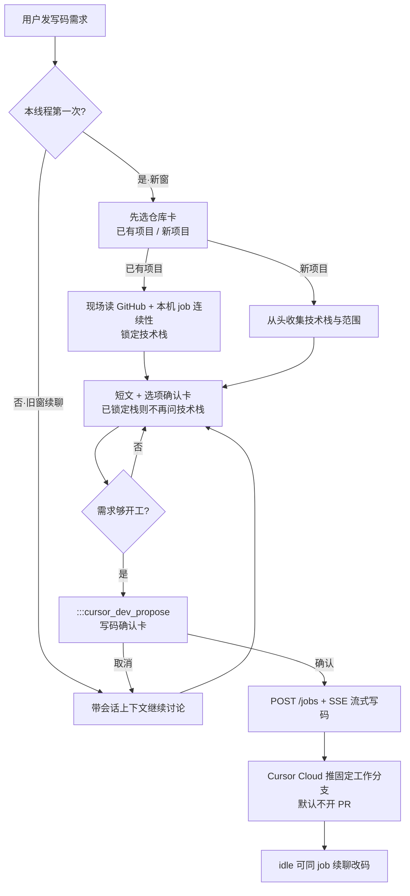

# Cursor 写码车道 · 原理与完整流程

> 更新：2026-08-05  
> 原则：同事零配置；改远程 GitHub 由服务端 Cursor Cloud 执行。

---

## 1. 原理（一句话）

同事只在 WorkBuddy 聊天；**需求澄清走本机 Deep Agents**，真正改 GitHub 由服务端用 **Team 的 `CURSOR_API_KEY` 调 Cursor Cloud Agent**（Team 已装的 GitHub App）完成。同事不配 Cursor、不配 Git。

```text
浏览器 Chat
  ├─ 写码讨论 / 选项卡 / 确认卡     → 前端 + Deep Agents（不写仓）
  └─ 用户点「确认写码」             → API 建 job → Cursor Cloud → 推到固定分支（如 hebo）
```

---

## 2. 架构关系

```text
同事浏览器 → WorkBuddy（ERP 登录）
                 ↓
         服务端唯一 CURSOR_API_KEY（Team）
                 ↓
         Cursor Cloud Agent（团队已授权的 GitHub App）
                 ↓
         白名单 GitHub 仓库（固定工作分支 / 可选 PR）
```

| | 写码车道 | MES / 本机 Agent |
|--|----------|------------------|
| 改哪里 | 远程 GitHub | 平台 API / 本地沙箱 |
| 谁执行 | Cursor Cloud | Deep Agents + 工具 |
| 触发 | 确认卡 `confirmed=true` | 普通对话 / 写操作确认 |

确认写码后**不会**再走「本机 echo/clone 代替改仓」那条路。

---

## 3. 完整流程（同事侧）



### 3.1 分步说明

1. **意图识别**  
   前端识别「写代码 / 新增首页 / ERP…」等 → 进写码讨论，不进 MES 工具乱调。

2. **新窗先选仓**  
   - 已有项目：`GET /api/cursor-dev/repos/inspect` 读仓 + 历史写码 job → 锁定栈与风格。  
   - 新项目：再问技术栈等（选项卡勾选）。

3. **旧窗续聊**  
   不重选仓；短回复继续澄清；已 idle 的写码 job 可直接 follow-up。

4. **选项确认卡**  
   能勾选就不打字；技术栈已锁定时前端会剥掉误出的技术栈组。

5. **写码确认卡**  
   用户点确认（可选「开 PR」，默认不勾）才真正开写。

6. **Cloud 执行**  
   - 建 job，`ref` 固定为工作分支（如 `.env` 中 `CURSOR_DEV_WORK_BRANCH=hebo`）。  
   - Prompt 要求只在该分支提交，禁止功能后缀分支（如 `dev/workbuddy-erp-xxx`）。  
   - `GITHUB_TOKEN` 只服务端预检/读仓用；改仓靠 Cursor↔GitHub App。  
   - 完成后代码在 GitHub 工作分支；**手动合 main**（或勾选才尝试开 PR）。

---

## 4. 分支策略（当前约定）

| 约定 | 说明 |
|------|------|
| 固定工作分支 | `CURSOR_DEV_WORK_BRANCH`（样例仓为 `hebo`） |
| 起始参考 | `CURSOR_DEV_STARTING_REF`（可与工作分支相同） |
| 合入默认分支 | 默认**不开 PR**；由人在 GitHub 上手动合 `main` |
| 禁止 | 一功能一支（带随机后缀的 `dev/workbuddy-*`） |

说明：分支名主要靠 **系统 Prompt 约束**；上线后应用一轮实开写码验证是否只推送目标分支。

---

## 5. 管理员侧（一次配置）

| 项 | 作用 |
|----|------|
| Cursor Team + Cloud Agents + GitHub App | Cloud 能读写白名单仓 |
| `CURSOR_API_KEY` | 服务端唯一 Key |
| `CURSOR_DEV_REPO_ALLOWLIST` | 可写仓库 |
| `CURSOR_DEV_WORK_BRANCH` / `STARTING_REF` | 固定推送/起始分支 |
| `GITHUB_TOKEN` 或 `CURSOR_DEV_GITHUB_TOKEN`（建议） | 防匿名 API 限流，读仓/预检更稳 |

同事只需：**WorkBuddy 登录 → 聊天**。

详细上线步骤见：[Cursor写码车道管理员上线清单.md](Cursor写码车道管理员上线清单.md)

### 5.1 `GITHUB_TOKEN` 获取

1. https://github.com/settings/tokens → **Generate new token (classic)**  
2. 勾选至少 `repo`  
3. 写入服务端 `.env` 后重启 API  

Token 仅服务端使用，不发给同事。

---

## 6. 关键 API / 前端入口（备忘）

| 能力 | 入口 |
|------|------|
| 可用性 / 白名单仓 | `GET /api/cursor-dev/status`、`/repos` |
| 现场读仓 | `GET /api/cursor-dev/repos/inspect` |
| 建写码任务 | `POST /api/cursor-dev/jobs`（须 `confirmed=true`） |
| 流式进度 | `GET /api/cursor-dev/jobs/{id}/stream` |
| 同 job 续聊 | `POST /api/cursor-dev/jobs/{id}/messages` |
| 先选仓卡 | `CursorDevRepoAnchorCard.vue` |
| 选项 / 确认卡 | `CursorDevOptionsCard.vue`、`CursorDevRepoPickCard.vue` |
| 讨论 Skill | `apps/agent/skills/cursor-dev-chat/SKILL.md` |

---

## 7. 相关文档

- [Cursor写码车道管理员上线清单.md](Cursor写码车道管理员上线清单.md)  
- [Cursor-SDK研发写码一期方案.md](Cursor-SDK研发写码一期方案.md)  
- [每日复盘总结/2026-08-05.md](../复盘/每日复盘总结/2026-08-05.md)  
