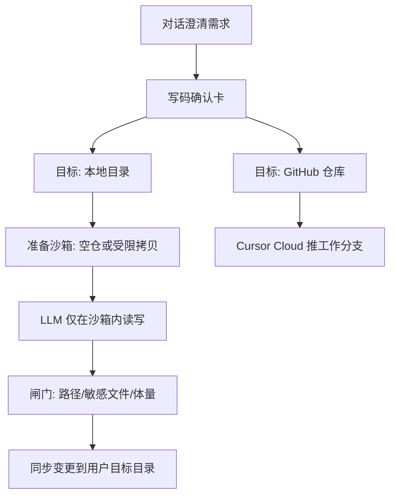

# 本机目录写码与沙箱隔离方案

> 状态：**P0 已落地**（目录沙箱 + 路径闸门；非 Docker 进程隔离）  
> 日期：2026-08-11  
> 关系：与 [`Cursor-SDK研发写码一期方案.md`](Cursor-SDK研发写码一期方案.md)、[`Cursor写码车道原理与完整流程.md`](Cursor写码车道原理与完整流程.md) 并列——**本地目录为默认写码目标**，GitHub + Cursor Cloud 保留为第二入口  
> 交付形态：网页继续可用；同事本机分发见 [`桌面端与网页双交付方案.md`](../桌面与部署/桌面端与网页双交付方案.md)（谨慎分阶段落地，不得影响本方案已验收能力）
> 产品锚点：同机可落盘到用户所选工程，但 **禁止 Agent 裸写宿主机**

---

## 1. 目标与边界

### 1.1 目标（可验收）

用户在主对话里澄清需求 → 写码确认卡默认选 **本地目录** → 系统在 **隔离沙箱** 内改代码 → 校验通过后 **同步到用户确认的本机路径** → **确保开发服务并给出预览地址**，用户打开浏览器即可验收。

- **新项目**：用户选空（或可写空）目录，从零生成  
- **改已有**：用户选该工程根路径  
- **记忆**：按登录用户记住「上次本地目录」，下次确认卡默认带出  
- **双入口**：本地 / GitHub 并列，**默认本地**

### 1.2 「同机」≠「裸写宿主机」

| 概念 | 含义 |
|------|------|
| 同机 | API 与目标目录在同一台机器（本地 `dev.sh` 场景），无需远程 Bridge 写盘 |
| 沙箱写 | LLM 工具只读写 `DATA_DIR/local_dev/sandboxes/{job_id}/`，碰不到 Desktop 其它目录、系统目录 |
| 同步落盘 | 任务成功且闸门通过后，才把变更文件拷到用户确认的目标路径 |

这样既满足「改完在本机目录能看到」，又避免一轮跑偏污染整台机器。

### 1.3 明确不做（本期 / P0）

- 远程 API 经 VS Code Bridge 写盘  
- Docker / gVisor 进程级沙箱（二期可加：容器仅挂载该 sandbox 目录）  
- 删除或替换现有 Cursor Cloud / 白名单能力  
- 依赖浏览器系统目录选择器拿真实绝对路径（以路径输入 + 上次记忆为主；可选后续用 IDE 回传路径）

---

## 2. 端到端流程

确认卡默认停在「本地目录」：

- 路径输入框（粘贴绝对路径）+「常用 / 上次」一键填入  
- 校验：目录存在、可写；空目录允许（新项目）；非空须像工程目录（`package.json` / `requirements.txt` / `frontend+backend` 等），拒绝用户主目录、整个 Desktop 等过宽路径  
- GitHub 页签仍为现有仓库 / 分支 / PR，走 Cloud，不经本沙箱

---

## 3. 沙箱设计（P0 定稿）

### 3.1 位置与生命周期

- 根目录：`DATA_DIR/local_dev/sandboxes/{job_id}/`  
- **新项目（空目录）**：沙箱从空开始生成  
- **已有工程**：确认后做 **受限拷贝** 进沙箱  
  - 排除：`node_modules`、`.git/objects` 等大对象、`dist`、`__pycache__` 等  
  - 保留：源码与必要配置  
- 任务结束（成功 / 失败 / 取消）后可保留沙箱若干天便于排错，或提供清理接口  
- **失败不同步**，宿主机目标目录保持原样

### 3.2 闸门（写入沙箱时也强制）

- 所有工具路径必须是相对路径；`resolve` 后仍落在沙箱根内（防 `../` 逃逸）  
- 禁止改 / 删：`.env`、`*.pem`、凭证类文件，以及沙箱外任何路径  
- 上限：单文件大小、单次任务改动文件数、总写入字节；超限则失败并 **不同步**  
- 同步阶段再次校验：只同步「相对路径变更列表」中的文件到目标根下对应位置

### 3.3 同步策略

- 成功后 **自动同步** 到确认卡所选目标路径（产品目标就是落本地工程）  
- 同步成功后 **确保开发服务**：已在监听则复用（Vite HMR / uvicorn `--reload`），未跑则在目标工程内启动；**不**强杀已有进程  
- 完成卡片展示：目标路径、变更文件列表、**本机预览 URL**、沙箱 id  
- 文案：已同步；可打开预览验收（预览失败不回滚同步，仅提示原因）

> P0 不用 Docker：macOS 本地开发用「目录沙箱 + 路径闸门」即可。二期若需进程级隔离，再加 Docker 仅挂载该 sandbox 目录。

### 3.4 与 host_path_guard 的关系

- **不**把用户目标根交给 `host_path_guard` 放行任意 `/Users/...` 直写  
- Agent 文件工具只指向沙箱根；主对话里未确认前仍拦截宿主机绝对路径读写

---

## 4. 模块与接口规划

### 4.1 用户偏好（上次目录）

- 存储：`DATA_DIR/user_prefs/{username}.json`  
- 字段：`last_local_workspace`  
- API：`GET/PUT`（登录用户；中文 tags / summary，见后端 API 中文注释规范）  
- 确认卡打开时拉上次路径；确认成功后写回

### 4.2 前端确认卡

改 `apps/web/src/components/CursorDevRepoPickCard.vue`（或拆 `WriteTargetPickCard.vue`）：

- Tab：**本地目录（默认）** | **GitHub**  
- 本地 Tab：需求摘要 + 本地路径 + 上次路径芯片；无分支 / PR  
- 确认：本地 → `POST /api/local-dev/jobs`；GitHub → 现有 `POST /api/cursor-dev/jobs`  
- `page_context`：本地确认后带 `workbuddy_lane=code_dev`、`local_workspace_root=...`（与审码的 `ide_workspace_root` 可并存；写码以 `local_workspace_root` 为准）

### 4.3 后端执行层（新模块）

新增 `apps/local_dev/`（与 `apps/cursor_dev` 并列，互不影响）：

| 职责 | 说明 |
|------|------|
| `config.py` | 开关、拷贝排除规则、体量上限、并发等 |
| `workspace.py` | 校验目标绝对路径存在 / 可写；规范化；拒绝系统敏感目录 |
| `sandbox.py` | 创建沙箱、受限拷贝、闸门、同步到目标 |
| `dev_runtime.py` | 同步后确保 FE/BE 开发服务并返回预览 URL |
| `jobs.py` | 任务落盘 `DATA_DIR/local_dev/` |
| `service.py` | 在沙箱内用现有对话模型驱动实现 Agent |
| `tools_fs.py` | `list/read/write/mkdir` 仅允许相对路径解析到沙箱内 |

执行策略：

- **不走 Cursor Cloud**；同机用现有 LLM（`Config.LLM_*` / 设置页覆盖）  
- 流式事件对齐现有写码 UX：`step` / `token` / `done` / `error`（`done` 可带 `preview_url`）  
- 无 `merge_guide`；改为「已写入本地」摘要 + 变更文件列表 + 预览链接

HTTP：`apps/api/routes/local_dev.py`（中文 tags「本机写码」），挂到 `apps/api/main.py`。

### 4.4 对话侧 Skill / 机器块

- `cursor-dev-chat` Skill / 写码系统提示：确认前机器块带目标类型；默认引导「选本地目录」  
- 机器块扩展：`:::cursor_dev_propose` 增加 `target: local|github`（缺省 `local`）；本地可不填 `repo`  
- GitHub 分支逻辑保持现状

---

## 5. 与「写完 ERP 看不见」的关系

- **GitHub / Cloud 模式**：只推工作分支，本地 ERP 不会自动更新，需合入 + pull + 重启（既有说明保留）  
- **本机目录模式**：同步完成后文件已在用户所选工程根；系统会 **确保开发服务并给出预览地址**（已在跑则复用热更新，未跑则启动）。确认卡可点开本机 URL 验收；合入指引卡仅 GitHub 模式出现

---

## 6. 主要改动清单（实施时）

- 新：`apps/local_dev/*`（含 `dev_runtime.py`）、`apps/api/routes/local_dev.py`、用户偏好读写  
- 改：确认卡 Vue、`ChatView.vue` / `api.js`、写码 Skill / 提示词、`main.py` 挂载  
- 安全：不放宽「任意 /Users 直写」；仅沙箱内写 + 受控同步；预览启动不杀已有端口进程

---

## 7. 验收清单

1. 默认确认卡为本地；填空目录 → 沙箱生成 → 同步后目标目录出现文件  
2. 选已有工程路径 → 沙箱内改；失败时目标目录无脏写；成功后仅列表内文件更新  
3. 尝试写沙箱外或 `.env` → 被拒且不同步  
4. 再次打开确认卡默认带出上次路径  
5. 切换 GitHub Tab 仍能走 Cloud 写仓  
6. 未确认前，Agent 仍不能随便 `read_file(/Users/...)`  
7. 同步成功后确认卡给出预览 URL；服务已在跑则复用不强杀；未跑则自动启动；预览失败时任务仍成功并提示原因

---

## 8. 二期可选

- Docker 进程沙箱：容器仅挂载 `sandboxes/{job_id}`  
- 同步前二次确认（diff 预览后再应用）  
- VS Code Bridge「选文件夹回传绝对路径」  
- 沙箱定期清理 API / 定时任务  
