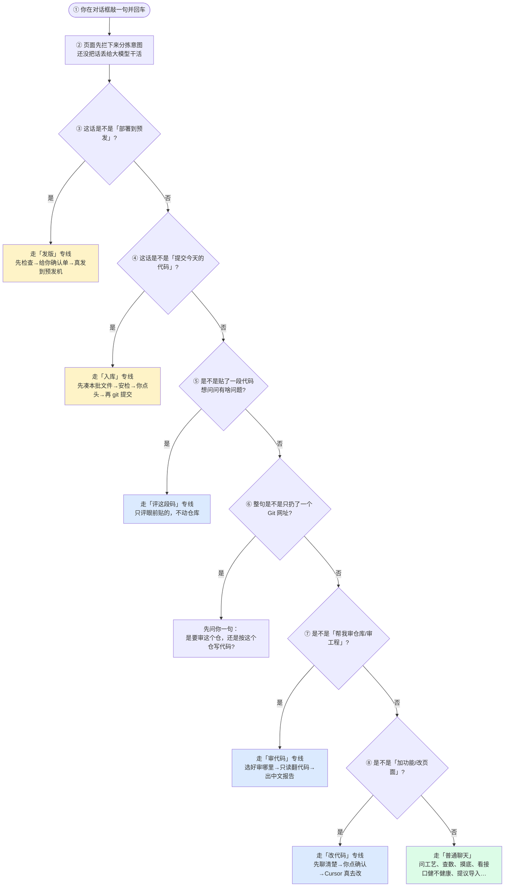
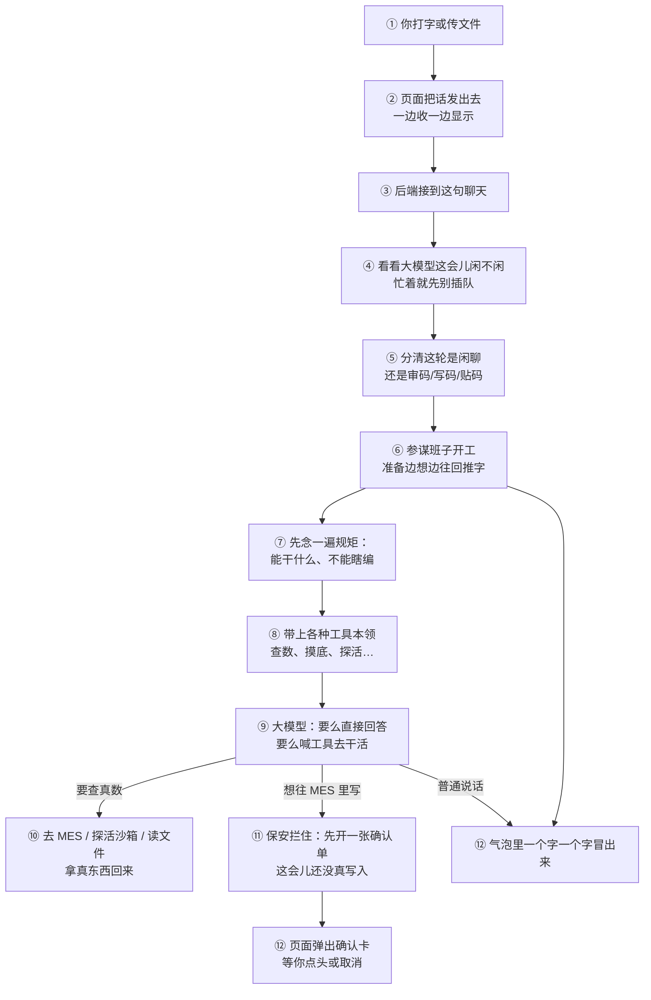
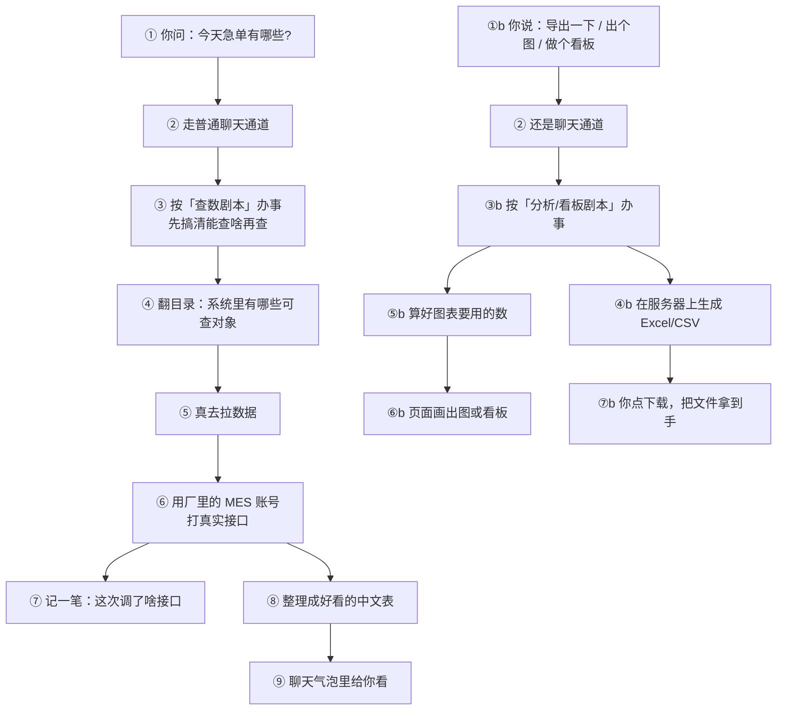
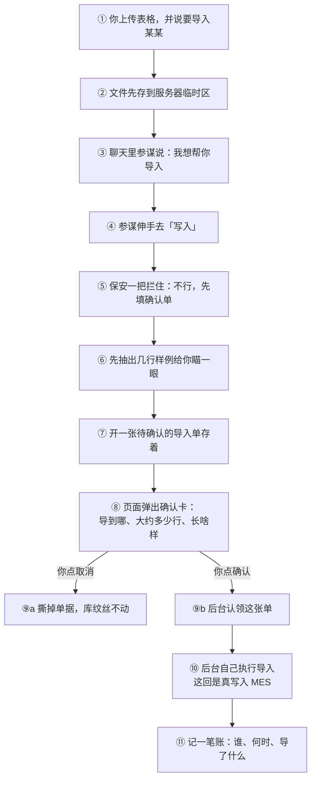
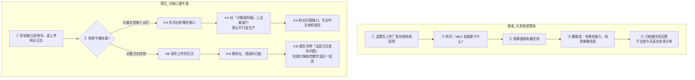
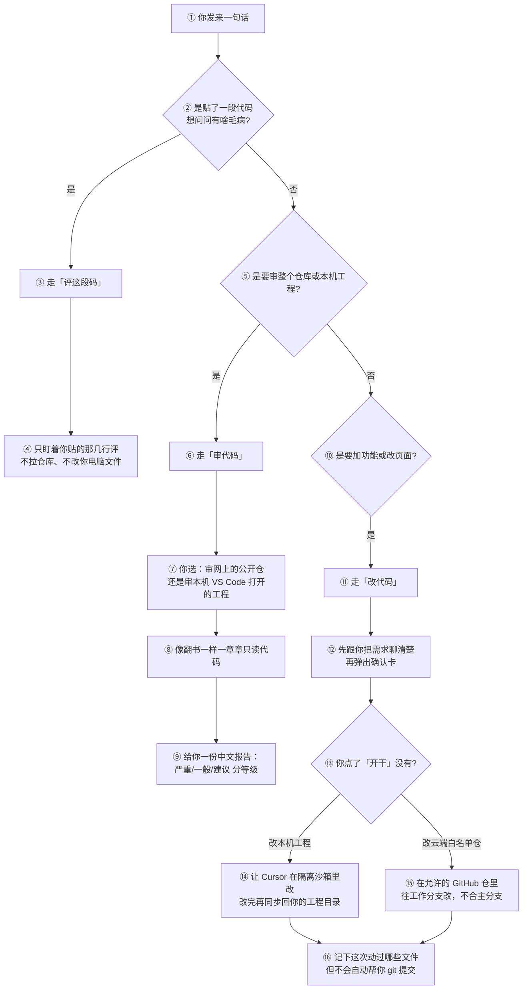
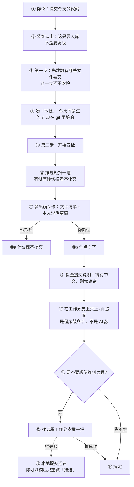
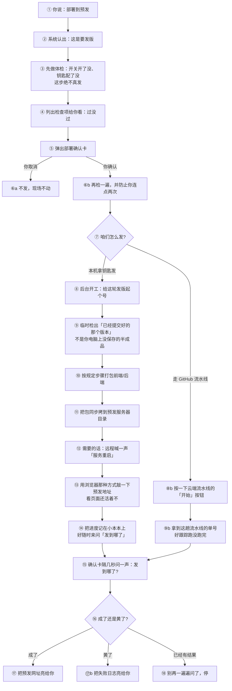
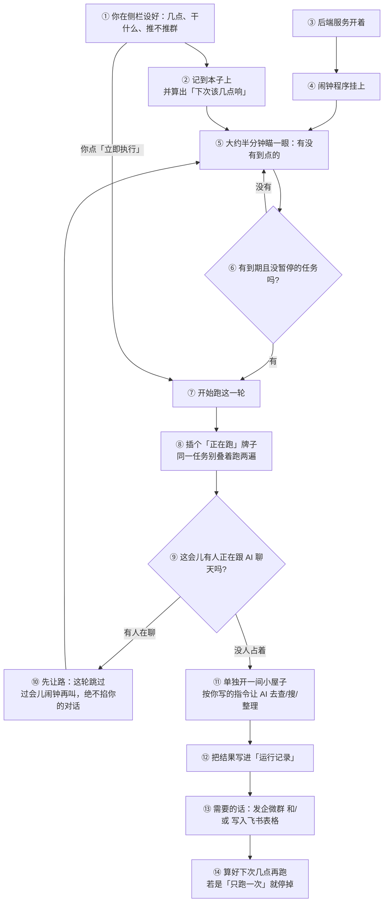
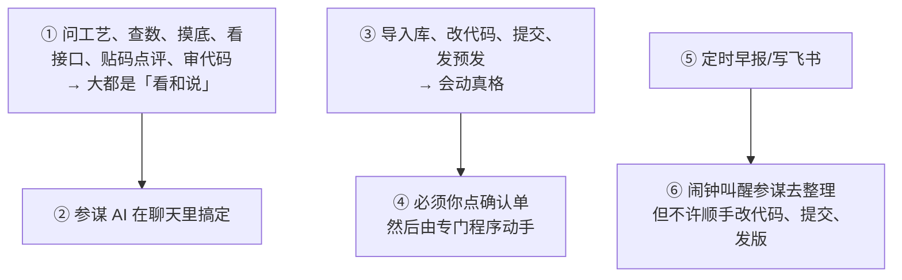

# ZR WorkBuddy · 功能实现流程图总览

> **怎么看：** 图上每个框都是大白话；图下表多一列「对应代码」（给改程序的人对照）。  
> 预览：把 \`\`\`mermaid 段贴到 [mermaid.live](https://mermaid.live)，或 Cursor 装 Mermaid 预览。  
> 颜色：黄 = 要签字/真动手；蓝 = 聊天里分车道；绿 = 普通聊天或安全收尾。

---

## 0. 总图：你说一句话，系统先分拣到哪条线？

### 节点说明（§0）

| 节点 | 大白话 | 对应代码（可选看） |
|------|--------|-------------------|
| ① | 你说话 | — |
| ② | 前端按固定顺序猜你想干啥 | `ChatView.send` + `chatIntent.js` |
| ③ | 像发版吗？是就进发版专线，不让大模型自己 SSH | `looksLikeDeploy` |
| ④ | 像提交入库吗？ | `looksLikeLocalCommitBatch` |
| ⑤ | 像贴码点评吗？ | `looksLikePasteCodeAnalyze` |
| ⑥ | 只丢了个链接，先问清楚意图 | `isBareGitRepoUrlMessage` |
| ⑦ | 像审代码吗？ | `looksLikeCodeReview` |
| ⑧ | 像改功能吗？ | `looksLikeCodeDevIntent` |
| 黄框终点 | 要人点确认、程序真动手 | 功能 09 / 10 |
| 蓝框终点 | 还在聊天里，但分了审/写/贴车道 | 功能 06 / 07 / 08 |
| 绿框终点 | 普通参谋聊天 | 功能 01～05 等 |

对应分册：[00-总览](./00-总览与架构分流.md)

---

## 1. 普通聊天：一句话怎么变成屏幕上的回答？

### 节点说明（§1）

| 节点 | 大白话 | 对应代码（可选看） |
|------|--------|-------------------|
| ①～② | 你说，页面传 | `ChatView` |
| ③ | 后端收消息 | `POST /api/chat/stream` |
| ④ | 同一时刻别两路大模型抢着聊 | `try_acquire_stream_lock` |
| ⑤ | 贴码/审码/写码别串台 | `sanitize_page_context_lanes` |
| ⑥～⑧ | 搭好「参谋+工具箱」 | `AgentRunner` / `create_deep_agent` |
| ⑨ | 模型选：直接说，或喊工具 | Tools / Skills |
| ⑩ | 真去查系统 | MES、沙箱等 |
| ⑪ | 写库必须先给你看单子 | `WriteConfirmMiddleware` |
| ⑫ | 你看见字、图或确认卡 | 前端渲染 |

---

## 2. 查数 / 导出 / 出图

### 节点说明（§2）

| 节点 | 大白话 | 对应代码（可选看） |
|------|--------|-------------------|
| ① | 用人话要数 | — |
| ③～⑤ | 先看菜单再点菜，再上菜 | `query-mes-data` / `query_platform_data` |
| ⑥ | 真连 MES，不是 AI 瞎编 | `platform_api` + `MES_API_*` |
| ⑦ | 出问题能翻日志 | `append_api_call` |
| ⑧～⑨ | 整理好看给你 | `present_query_result` |
| ④b～⑦b | 导出文件或画图给你下 | `export_platform_data` / 图表卡 |

**前提：** 设置里挂好接口说明书和 MES 账号。

---

## 3. 导入 Excel：没点确认，库里一行都不会进

### 节点说明（§3）

| 节点 | 大白话 | 对应代码（可选看） |
|------|--------|-------------------|
| ①～② | 你交表，系统先收着 | `POST /api/upload` |
| ③～④ | AI 只能「申请导入」 | Skill + `import_file_to_platform` |
| ⑤～⑦ | 申请变确认单，还没入库 | `WriteConfirmMiddleware` / pending |
| ⑧ | 你签字的地方 | `WriteConfirmCard` |
| ⑨a | 不签字就作废 | cancel |
| ⑨b～⑩ | 你点头后，**程序**入库，不是 AI 再嘴炮一次 | confirm → 同名导入函数 |
| ⑪ | 留底可查 | 审计 |

---

## 4. 摸底 vs 看接口健不健康（别当成一回事）

### 节点说明（§4）

| 节点 | 大白话 | 对应代码（可选看） |
|------|--------|-------------------|
| 摸底①～⑤ | 读说明书，讲「能管啥」，**不当今日产量** | `analyze-mes-schema` 等 |
| 探活 A | 对着文档，在沙箱里「敲敲门看谁应」 | `build_api_catalog` / `probe_api_catalog` |
| 探活 B | 对着旧日志找常挂的接口 | `import_external_api_logs` 等 |
| 别混 | 沙箱不通 ≠ 生产挂了；日志错误率 ≠ 沙箱失败数 | Skill 硬约束 |

---

## 5. 贴码 / 审仓 / 改功能：三条道别走串

### 节点说明（§5）

| 节点 | 大白话 | 对应代码（可选看） |
|------|--------|-------------------|
| ②～④ | 贴码点评：当面批作业，不动档案柜 | `paste_code` |
| ⑤～⑨ | 审代码：只读开卷考试，出报告 | `code_review` + git/ide 工具 |
| ⑩～⑯ | 改代码：聊清楚→你点头→施工队（Cursor）动手 | `code_dev` + local/cursor Job |
| ⑯ | 改完先记「本批文件」；要入库再说「提交今天的代码」 | `synced_files` → 功能 09 |

---

## 6. 提交入库：先凑名单，再安检，你点头才 commit

### 节点说明（§6）

| 节点 | 大白话 | 对应代码（可选看） |
|------|--------|-------------------|
| ③ | **只点名**，像先列清单 | `.../commit-batch/prepare` |
| ⑤～⑥ | **才安检**，别以为 ③ 完事了就过关 | `.../commit-batch` + `run_commit_review_gate` |
| ⑦ | 给你签字 | 提交确认卡 |
| ⑩ | 真入库到工作分支 | `git_commit` |
| ⑫～⑬ | 推远程失败也不撤本地提交 | `push_retry` |

---

## 7. 部署到预发：先体检开单，你点头才真发

### 节点说明（§7）——对应你截图里那几格

| 节点 | 大白话 | 对应代码（可选看） |
|------|--------|-------------------|
| ③～④ | 开单体检，**不发货** | `prepare_deploy` |
| ⑤～⑥b | 你签字；防手抖连点 | 确认卡 / `confirm_deploy` |
| ⑦ | 本机钥匙发，或云端流水线发 | `DEPLOY_CI_PROVIDER` |
| ⑧～⑪ | 取出已提交版本→打包→拷到预发机 | `deploy_local_ssh` |
| ⑫ | 可选：让预发机上的服务重启一下 | `DEPLOY_SSH_RESTART_CMD` |
| ⑬ | 敲一下预发网址，看还回不回得来 | `probe_deploy_health`（探活） |
| ⑭ | 进度记在内存小本本，刷新状态用 | 内存 `_JOBS` |
| ⑧b | 不是本机拷文件，而是去 GitHub 点「跑流水线」 | `workflow_dispatch` |
| ⑨b | 拿到流水线单号，好查跑到哪 | `run_id` |
| ⑮ | 确认卡像小孩问「好了没」——隔几秒问进度 | `POST /deploy/poll` |
| ⑰～⑱ | 成功给链接；完事就别无限问 | 停轮询 |

对应：[10-人触发预发部署](./10-人触发预发部署.md)

---

## 8. 自动化任务：设好闹钟，到点自己干活（但不许自动发版）

### 节点说明（§8）

| 节点 | 大白话 | 对应代码（可选看） |
|------|--------|-------------------|
| ①～② | 你设闹钟 | 自动化任务页 / `automations.json` |
| ⑤～⑥ | 闹钟到点 | `scheduler` / `should_run_now` |
| ⑨～⑩ | **人聊优先**，任务让路 | `stream_lock`，`wait_sec=0` |
| ⑪ | 独立会话跑指令 | `execute_automation` |
| ⑬ | 推群、写表；**不会**自动提交/部署 | 企微 / 飞书投递 |

对应：[11-自动化任务](./11-自动化任务.md)

---

## 9. 一句话记住谁能动真格

---

## 10. 晕了看这里

| 你晕在哪 | 看哪节 | 分册 |
|----------|--------|------|
| 一句话进哪条线 | §0 | [00](./00-总览与架构分流.md) |
| 查数怎么来的 | §2 | [02](./02-MES数据查询导出与分析.md) |
| 导入了库里没有 | §3 | [03](./03-文件导入与受控写入.md) |
| 贴码/审码/写码分不清 | §5 | [06](./06-粘贴代码分析.md)～[08](./08-写码改功能.md) |
| 提交为啥两步 | §6 | [09](./09-人触发提交.md) |
| 发版框看不懂（探活/流水线/隔几秒问进度） | §7 | [10](./10-人触发预发部署.md) |
| 定时任务会不会自动发版 | §8 | [11](./11-自动化任务.md) |

口述：[给领导讲明白-口述稿](./给领导讲明白-口述稿.md)
