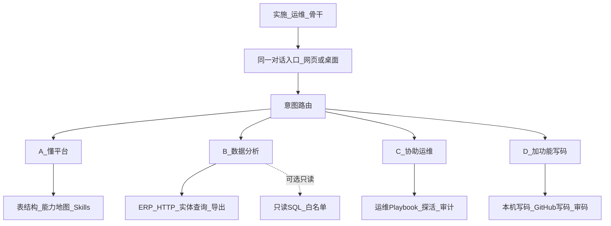

# ZR WorkBuddy · MES「懂行助手」四块能力方案

> 状态：**方案稿（待评审）**  
> 日期：2026-08-17  
> 产品名：对外统一 **ZR WorkBuddy**  
> 承接：[`第二阶段产品方向.md`](../产品规划/第二阶段产品方向.md)、[`WorkBuddy总体实现方案.md`](WorkBuddy总体实现方案.md)、[`桌面端与网页双交付方案.md`](../桌面与部署/桌面端与网页双交付方案.md)、[`本机目录写码与沙箱隔离方案.md`](../写码与审码/本机目录写码与沙箱隔离方案.md)  
> 一句话定位：对**已有 MES**——**读懂 → 查得动 → 运维帮得上 → 需要时能改代码加功能**；人不离开同一对话入口。

---

## 0. 目标与边界

### 0.1 要做成什么

面向已上线的 MES（以中软 / CIMOM 类现场为典型），让实施、运维、业务骨干在 **网页或桌面端** 用自然语言完成：

| # | 能力块 | 用户价值 |
|---|--------|----------|
| **A** | **很懂这个 MES** | 说清模块、对象、表/API、业务链路与术语，少翻文档、少问人 |
| **B** | **数据分析** | 查真实业务数据、做统计/异常/趋势，能导出报告 |
| **C** | **协助运维** | 值班话术固定化：排障、探活、筛异常单、变更可审计 |
| **D** | **加界面加功能** | 在已有前后端仓库上改页、加接口；确认后写码，可审码验收 |

### 0.2 明确不做（本方案范围外）

- 另做一套 MES / 替代现有排产、过站、报工核心系统  
- 默认直连生产库做写操作（INSERT/UPDATE/DELETE）  
- 「写代码 → 测 → 合主干 → 自动部署」全自动流水线（仍为愿景；写码车道只到工作分支 / 本机预览）  
- 多租户 SaaS 化、通用企业 Agent 平台化  

### 0.4 系统名称与资料目录（贴合现场：表结构 + 接口文档）

实施侧通常**只有**：

1. **数据库表结构**（Markdown/字典导出）→ 用来「读懂 MES」  
2. **接口文档**（OpenAPI / Swagger 的 `openapi.json`）→ 用来「能查什么」

不必手写 `entities.json`。上传接口文档后，系统自动生成「可查对象」草稿（列表路径、分页参数从该文档读取）；可再人工改别名。换一套 MES 只需改平台名称并重新上传表结构与接口文档。**WorkBuddy 登录与这份接口文档无关**，不要把 MES 登录接口当成产品登录。

未填平台名称或未上传资料时：**无法**查数/表结构摸底，须先在「系统配置 → MES 接入」配置。资料目录落在 `DATA_DIR/mes_profiles/{id}/`。

---

## 1. 能力总览与现状对照



| 能力块 | 现有底座（已落地） | 主要缺口 |
|--------|-------------------|----------|
| **A 懂平台** | 资料包表结构；无 overlay 可推断能力地图（含 `markdown_summary`）；场景表关键字匹配；`inspect_mes_profile`；`compare_schema_vs_catalog`（含对照 markdown） | 现场长期校准流水线；摸底 10 句仍需人工抽检对话质量 |
| **B 数据分析** | 真 ERP 查数/筛选/汇总/导出；中文表；指标口径；分析简报；**`render_analysis_chart` + ECharts**；**资料包 `metrics.json` / `analysis.json` / 可选 `metric_packs`**；产线异常日报；可选只读 SQL | 字段级权限；跨引擎只读 SQL；现场口径校准；**通用 BI / PCB 六看板见 [`通用BI与PCB分析里程碑.md`](../MES业务/通用BI与PCB分析里程碑.md)** |
| **C 协助运维** | `list_ops_scenes` / `run_ops_scene`；紧急/401/探活/简报/故障树；值班简报含分布 markdown + 导出提示；写确认与审计 | 日志/告警只读接入；变更窗口与双人确认 |
| **D 加功能** | 本机/GitHub 写码与审码；`mes_change_preflight`（含 `acceptance_markdown`）；`stack_chain` + 同步后 SQLite 闸门；**写码摘要附改后验收清单**；**本机写码后数据侧自动轻量查数**（`MES_POST_DEV_QUERY`，失败不挡成功） | 非 SQLite 库的迁移/回填；GitHub 写码车道尚无自动查数 |

---

## 2. 能力块 A：很懂这个 MES

### 2.1 产品定义

回答三类问题，且**不假装查了实时库**：

1. **能力摸底**：「平台能管哪些业务？仓储/品质各管什么？」  
2. **对象与链路**：「工单从下达到入库涉及哪些表/接口？」  
3. **术语澄清**：「工单 vs 排产」「IPQC / OQC」  

数据来源分层：

| 层 | 来源 | 用途 |
|----|------|------|
| L0 文档字典 | 表结构 MD + `capability_map.json` | 离线也能答「有什么能力」 |
| L1 API 契约 | OpenAPI / 路由清单 / `entities.json` | 答「怎么查、怎么导」 |
| L2 现场校准 | 只读抽检真库或真 API 样例 | 纠正文档过期、别名错误 |

### 2.2 功能清单

| ID | 功能 | 说明 | 优先级 |
|----|------|------|--------|
| A1 | 人话能力地图 | 按模块输出「能干什么 + 代表表 + 可怎么问」；无 overlay 时按当前表结构域推断 | P0（已加强：换平台不必手写 capability_map.json） |
| A2 | 场景表包 / API 包 | 固定场景一包表；按当前文档表名/中文匹配，不写死 TBL_* | P0（已加强） |
| A3 | 单表/单实体释义 | 字段含义、关联、常见坑 | P0 |
| A4 | 术语词典 | 中英/口语别名 → 规范实体 | P0 |
| A5 | 文档与现场差异报告 | 对照表结构 vs 接口目录（默认不抽检）；可选 sample_live | P1（已落地） |
| A6 | 导出摸底报告 | Markdown/Excel 给客户对齐 | P1（已有，含对照摘要） |

### 2.3 技术落点

- 工具：现有 schema / capability 工具链（见 [`表结构业务能力分析说明.md`](../MES业务/表结构业务能力分析说明.md)）；**换平台自检** `inspect_mes_profile`  
- Skill：强化「先地图、再缩模块、再场景、再单表」提问路径；禁止把模拟查数写进「平台能力」结论  
- 校准流水线（P1）：定时或手工「只读抽检」→ 生成 `docs` 或 `capability_map` 差异草稿，**人工确认后合入**  

### 2.4 验收（A）

- 固定 10 句摸底话术， entiy 不混、不声称「已查实时数」  
- 「工单下达→入库」能给出主表路径或主 API 路径  
- 故意问「今天有多少工单」时，路由到 **B**，不走纯文档瞎编  

---

## 3. 能力块 B：数据分析

### 3.1 产品定义

在**权限与口径清晰**的前提下，用自然语言完成：

- **明细查询**：按状态、时间、产线、优先级等过滤  
- **轻量分析**：计数、占比、TopN、异常清单（超时未完工、紧急单堆积）  
- **导出**：CSV/Excel 到约定目录，会话可追溯  

### 3.2 数据接入策略（关键）

**主路径（推荐）：ERP HTTP**

```text
用户登录 Token → PLATFORM_BASE_URL + entities.json path → query/export 工具 → 对话/表格展示
```

**补充路径（可选、默认关）：只读 SQL**

| 项 | 约定 |
|----|------|
| 权限 | 只读账号；禁止 DDL/DML |
| 网络 | 专线/VPN；桌面端仍经本机 API，不把密码打进安装包 |
| 范围 | 表白名单 + 行数/超时上限；禁止 `SELECT *` 无 LIMIT |
| 用途 | API 未覆盖的统计、对账、文档校准；**不**替代受控写操作 |

> 此前现场 SQL Server（如 `CIMOM`）若 TCP 不通，本块分析只能停在文档/沙箱；**接通网络或改用可达的 ERP API 是 B 的前置条件**。

### 3.3 功能清单

| ID | 功能 | 说明 | 优先级 |
|----|------|------|--------|
| B1 | 真 ERP 实体对齐 | 工单/计划等 `path` 与现场一致；沙箱仅作降级 | P0 |
| B2 | 高频过滤话术 | 状态、优先级、时间窗；实体硬边界 | P0 |
| B3 | 结构化结果展示 | 对话内表格 + 「说明过滤条件」 | P0 |
| B4 | 导出可预期 | 路径、格式、条数上限提示 | P0 |
| B5 | 指标口径包 | 「在制」「当日完工」「紧急未完工」等定义进模板，运行时绑定当前目录 | P1（已落地工具） |
| B6 | 聚合分析工具 | count/group_by 走 API 聚合或受控 SQL | P1 |
| B7 | 分析报告模板 | 值班口径简报（当前目录能绑定的指标） | P2（已落地 ops-daily-brief；未做固定「产线异常日报」套版） |
| B8 | 字段级权限 | 按角色隐藏金额/客户等敏感列 | P2（本轮不做，以免误伤查数展示） |

### 3.4 技术落点

- `entities.json` + `query_platform_data` / `summarize_platform_data` / `export_platform_data` / `query_metric`
- 指标口径：内置 `metrics_default.json` + 资料包可选 `metrics.json` 按 id 覆盖；绑定当前目录实体与真实枚举
- Skill：`query-mes-data`、`ops-query-playbook`（以当前目录为准；轻量汇总按返回记录分组，不是 SQL）
- B3/B4 已落到工具返回：中文列名表格、`filters_applied`、导出绝对路径与行数
- 可选：`readonly_sql` 工具（新），挂在设置开关后；SSRF/连接串校验与现有 URL 消毒同级
- 前端：查询结果表（M1 可选已规划）升级为分析默认展示  

### 3.5 验收（B）

- 配置真实 `PLATFORM_BASE_URL` 后：「查 pending 工单」返回真数据且条件正确  
- ERP 不可达时：明确提示降级沙箱/失败，**不谎称真数**  
- 导出文件可找到；审计能关联会话用户  
- （若开只读 SQL）超限/非白名单表被拒绝  

---

## 4. 能力块 C：协助运维

### 4.1 产品定义

把值班高频动作做成**可重复的 playbook**：问一句 → 固定工具链 → 可读结论 → 需变更则确认。

典型场景：

| 场景 | 期望行为 |
|------|----------|
| 异常/紧急工单堆积 | 按优先级/状态筛 + 汇总条数 + 可选导出 |
| 接口是否可用 | 探活沙箱或指定健康检查；区分「助手侧」与「MES 生产」 |
| 导入失败 / 写失败 | 查审计、回放参数、给出重试或回滚建议（回滚须确认） |
| 登录/Token 异常 | 引导重新登录、检查 ERP 地址，不泄露密钥 |
| 「能不能改状态」 | 走受控写 + HITL，禁止默写 |

### 4.2 功能清单

| ID | 功能 | 说明 | 优先级 |
|----|------|------|--------|
| C1 | 运维场景清单固化 | 文档 + Skill 对齐 ≥8 条值班话术 | P0（已落地） |
| C2 | 异常单标准链 | 查询 → 汇总 → 导出 →（可选）受控更新 | P0（已落地 run_ops_scene） |
| C3 | 接口健康 | 现有沙箱探活 + 文档化「何时可对预发探活」 | P0（已落地） |
| C4 | 写操作确认与审计回看 | 已有 M2；补「谁改了什么」对话入口 | P0（已落地） |
| C5 | 故障排查树 | 无数据 / 401 / 超时 / 实体混用 → 分支提示 | P1（已落地 ops-diagnose） |
| C6 | 日志/告警只读接入 | 对接现场日志索引或告警 API（只读） | P2 |
| C7 | 变更窗口与双人确认 | 高危写操作二次确认或角色门槛 | P2 |

### 4.3 技术落点

- Skills：`ops-query-playbook`；工具：`list_ops_scenes` / `run_ops_scene`；手册：[`docs/MES业务/运维值班手册.md`](../MES业务/运维值班手册.md)
- Middleware：实体守卫、HITL 写确认  
- 工具：`query_write_audit`、健康分析工具、`query_metric`  
- 资料包可覆盖：`ops_scenes.json` / `metrics.json`  

### 4.4 验收（C）

- 8 条值班话术中 ≥6 条无需人工改提示词即可稳定走对工具  
- 任意写操作：未确认前零副作用  
- 探活默认不打生产；配置错误时有明确拒绝文案  

---

## 5. 能力块 D：加界面加功能

### 5.1 产品定义

在**已有 MES 前后端仓库**上，用对话完成：

1. 澄清需求（含截图对齐）  
2. 确认写码范围（本机目录或 GitHub 白名单仓）  
3. 执行写码 → 工作分支 / 本机预览  
4. （可选）审码报告  
5. 人工合入与发布（系统不自动合主干）  

与 A/B 的闭环：

```text
先 A/B 对齐真实实体或表
  → 再 D 改页面/接口
  → 再用 B 的查询或预览验收
  → 可选审码
```

### 5.2 功能清单

| ID | 功能 | 说明 | 优先级 |
|----|------|------|--------|
| D1 | 本机目录写码 | 桌面/网页选文件夹；相对导入门禁；同步预览 | P0（已有，持续加固） |
| D2 | GitHub 写码车道 | 白名单、确认后 Cloud Agent、默认工作分支 | P0（已有） |
| D3 | 审码 | 本机配对 / 远程只读克隆报告 | P0（已有） |
| D4 | 「改功能」前置清单 | 写码前可选对照当前目录；加字段须界面→接口→库表→写入；本机写码同步后闸门自动补列/回填 | P1（已落地 mes_change_preflight + stack_chain + stack_chain_gate） |
| D5 | 验收话术包 | 前置工具返回 acceptance_hints；本机写码成功后对数据侧变更自动轻量查数（可关，失败不挡成功） | P1（已落地提示 + 本机自动查数；不替代对话完整验收） |
| D6 | 与桌面双交付 | 安装包配置 Key/ERP 后可用写码；网页不回退 | P0（已有） |

### 5.3 技术落点

- `apps/cursor_dev`、`apps/local_dev`、IDE review 工具  
- Skill：写码澄清 / UI 设计；MES 改功能前置；**加列必须走完整数据链路**（`stack_chain.py`）；同步后 **SQLite 闸门自动回填**（`stack_chain_gate.py`）  
- 设置：Cursor Key、仓库白名单、本机路径策略（不进安装包密钥）  

### 5.4 验收（D）

- 确认前仓库无变更；确认后仅落约定分支或本机目标目录  
- 故意超白名单仓库被拒  
- 改完一轮可用对话给出 3 条验收步骤（含至少 1 条数据侧，若涉及查询）  

---

## 6. 统一体验与交付形态

### 6.1 同一入口，四块可切换

| 用户说法倾向 | 默认块 |
|--------------|--------|
| 「平台能干什么 / TBL_xx / 模块」 | A |
| 「查一下 / 统计 / 导出 / 趋势」 | B |
| 「紧急单 / 接口挂了 / 谁改过」 | C |
| 「加个页面 / 改按钮 / 按截图做」 | D |

路由原则：不确定时**先澄清一块**，避免同时开写码又查生产。

### 6.2 双交付

| | 网页 | 桌面 ZR WorkBuddy |
|--|------|-------------------|
| 适用 | 嵌入 ERP、集中部署 | 现场本机写码、离线配置 Key |
| 配置 | `.env` + 系统配置页 | `userData` + 系统配置页 |
| 能力 | A–D 同一套 | A–D 同一套 |

### 6.3 权限模型（建议）

| 角色 | A | B 读 | B 敏感列 | C 写 | D 写码 |
|------|---|------|----------|------|--------|
| 访客/未登录 | 否 | 否 | 否 | 否 | 否 |
| 实施 | 是 | 是 | 可选 | 确认后 | 白名单内 |
| 运维 | 是 | 是 | 是 | 确认后 | 按策略 |
| 管理员 | 是 | 是 | 是 | 是 | 是 |

P0 可继续「登录即可用 + 写操作确认」；字段级与角色门槛放 P2。

---

## 7. 分期落地（建议）

整体原则：**先真数据，再加深懂，再运维清单，写码用现成车道补闭环**。

### 阶段 P0（约 2–4 周）—「能真用」

| 序 | 交付物 | 对应块 |
|----|--------|--------|
| 1 | 打通现场 `PLATFORM_BASE_URL`（或等价只读 API）；实体 path 校准 | B |
| 2 | 高频查/导话术冒烟 + 结果表可用 | B |
| 3 | 能力地图 / 场景表包话术稳定（不混真数） | A |
| 4 | 运维 ≥8 条话术 playbook + 写确认审计回看 | C |
| 5 | 写码/审码/桌面回归不破坏 | D |

**P0 验收一句话：** 连上真 ERP 后，实施能查真工单/计划并导出；运维能按话术筛异常；摸底不胡说；写码确认后才改仓。

### 阶段 P1（约 4–6 周）—「好用」

- A5 文档与现场差异报告  
- B5–B6 指标口径 + 受控聚合（API 优先；SQL 只读可选）  
- C5 排查树  
- D4–D5 改功能前置清单 + 验收话术包  

### 阶段 P2（视资源）—「值班级」

- B7–B8 报告模板、字段权限  
- C6–C7 日志告警、双人确认  
- 指标看板（仍以对话驱动为主，不做大而全 BI）  

---

## 8. 风险与对策

| 风险 | 影响 | 对策 |
|------|------|------|
| ERP/库网络不通 | B/C 只能演示 | P0 把连通性列为门禁；桌面安装说明写清网络要求 |
| 文档与现场不一致 | A 误导实施 | L2 抽检 + 人工合入；回答标注「依据文档/依据抽检」 |
| 直连 SQL 被滥用 | 生产事故 | 默认关；只读账号；表白名单；无 DML；审计 |
| 写码改错库 | 业务故障 | 白名单、确认卡片、默认工作分支、审码、人工合入 |
| 期望「自动部署」 | 范围膨胀 | 对外话术对齐第二阶段：全自动单独立项 |
| 密钥进包/进库 | 泄露 | 设置页热更新；安装包不带 `.env`；SQL 连接串仅 DATA_DIR |

---

## 9. 与现有文档的关系

| 文档 | 关系 |
|------|------|
| [`第二阶段产品方向.md`](../产品规划/第二阶段产品方向.md) | 本方案是其「实施运维微助手」的**产品化展开**，并把写码升为并列第四块（仍引擎隔离） |
| [`表结构业务能力分析说明.md`](../MES业务/表结构业务能力分析说明.md) | 块 A 的细则 |
| [`实施高频场景清单.md`](../MES业务/实施高频场景清单.md) | 块 B/C 话术种子，需随真 ERP 扩展 |
| [`Cursor-SDK研发写码一期方案.md`](../写码与审码/Cursor-SDK研发写码一期方案.md) / 本机写码方案 | 块 D 细则 |
| [`桌面端与网页双交付方案.md`](../桌面与部署/桌面端与网页双交付方案.md) | 交付通道，不改四块业务语义 |

---

## 10. 建议的下一步（评审后选一刀）

按「稳」排序，建议评审会上只拍板 **一件** 作为下一刀开发：

1. **真数据接通**：校准 `PLATFORM_BASE_URL` + `entities.json` + 5 条查/导冒烟（块 B 门禁）  
2. **运维 8 场景**：把 C1 写成可执行 Skill + 测试用例  
3. **对着某套 MES 仓加一页**：用 D 跑通「前置清单 → 写码 → 验收话术」闭环  

拍板后，再拆具体开发任务单（含接口中文文档与验收勾选）。

---

## 附录：四块一句话对外表述

> **ZR WorkBuddy** 帮团队读懂现有 MES、用自然语言查数与做轻量分析、按值班话术协助运维（变更可确认可审计），并在需要时于本机或白名单仓库上加页面、加功能——网页与桌面同一套能力，稳妥可控。
