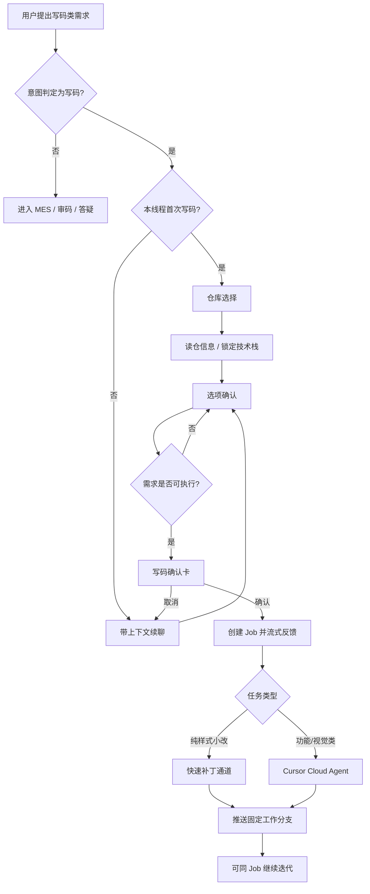

# WorkBuddy 总体实现方案

> 汇报文档 · 基于当前仓库真实实现  
> 仓库：`simplified-workbuddy` · 更新日期：2026-08-10  
> 结构说明：先讲**已实现能力**，再讲**架构与实现路径**，便于管理层与技术同事共同阅读。

---

## 文档定位

本文回答三个问题：

1. WorkBuddy **已经做成了什么**（可演示、可验收）  
2. **写码 / 审码**两条核心能力如何工作（含多场景）  
3. 技术框架是什么、有哪些风险与后续优化  

**产品定位（一句话）：**

> WorkBuddy 以**对话式写码**与**对话式代码审核**为核心能力：业务同事无需安装 Cursor、无需配置 Git，在 Web 对话中完成需求确认后，即可由服务端改写白名单 GitHub 仓库并推送固定工作分支；亦可对本机工程或远程仓库开展只读审核并输出报告。同一入口同时支持 MES/ERP 自然语言查询、数据导入导出与接口健康分析。

**相对传统方式的差异：**

| 传统方式 | WorkBuddy |
|----------|-----------|
| 改页面需本地 IDE + Git 操作熟练度 | 对话澄清 → 确认写码 → 云端改仓推分支 |
| 审代码依赖人工拉仓、逐文件翻看 | 本机扩展或远程克隆，分批读取后出报告 |
| 写与审边界不清，易误操作 | 写码 / 审码分车道，确认前不改仓 |

---

## 0. 已实现功能总览（汇报优先看本节）

以下均为**当前系统已落地能力**，不是远期规划。

### 0.1 核心能力一：对话写码（变更 GitHub 代码）

| 能力 | 用户侧操作 | 系统行为摘要 |
|------|------------|--------------|
| 变更已有项目功能/页面 | 选择仓库 → 勾选范围 → 确认写码 | 对话阶段澄清需求；确认后由 Cursor Cloud 改仓并推送固定工作分支 |
| 空仓 / 新项目起步 | 选择「新项目」，确认技术栈与范围 | 需求中锁定技术栈后再进入写码执行 |
| 同会话连续迭代 | 上一轮完成后补充「再调样式/文案」等 | 优先复用同一写码任务（Job）续聊，降低重复拉仓成本 |
| 按截图视觉对齐 | 上传截图 + 表达「与截图一致 / 1:1 / 按该效果」等 | 视觉模型生成规格；原图可随任务提交；按**质量优先**约束落地 |
| 按截图局部修改 | 如「按截图仅放大登录按钮」 | 仅处理明确改动点，避免整页无差别复刻 |
| 页面重做 / 强化设计 | 如「重做，避免照抄首页」 | 旧截图仅作字段参考，布局按新设计约束执行 |
| 纯样式 / 溢出修复 | 如「表格横向溢出，不改业务」 | 归入样式类任务；符合条件时可走快速补丁通道 |

**写码能力价值（可对外表述）：**

1. **终端用户零 Cursor / Git 配置**——密钥与 GitHub 授权收敛在服务端与管理员侧。  
2. **人在回路**——讨论阶段不改仓库；仅「确认写码」后执行。  
3. **变更范围可控**——仓库白名单；默认推送工作分支、默认不自动开 PR，降低误合主干风险。

### 0.2 核心能力二：对话审码（只读输出报告）

| 能力 | 用户侧操作 | 系统行为摘要 |
|------|------------|--------------|
| 审核本机工程 | Web 配对 VS Code → 说明审核范围 | 扩展读取本机文件并回传；Agent 分批索取后输出审核报告 |
| 审核远程 Git 仓库 | 明确「审核」意图并确认仓库地址 | 服务端浅克隆后分批读取源码，输出报告 |
| 粘贴代码片段咨询 | 粘贴源码并提问 | 走贴码分析能力；**不等于**全仓正式审核 |

**审码能力价值：**

1. **只读承诺**——审码路径不推送代码，与写码路径隔离。  
2. **覆盖两类现场**——未入库的本机工程、已托管的远程仓库均可审。  
3. **本机配对可持续**——配对成功后约 90 天自动保持连接，减少重复贴 Token。

### 0.3 配套能力（同一 Web 入口）

| 能力 | 说明 |
|------|------|
| ERP 统一登录 | 与 MES 账号体系对接；未登录不可进入对话 |
| 平台数据查询 | 自然语言查询工单、生产计划等；具备实体防混用约束 |
| 导入 / 导出 | 高风险写入须二次确认，并保留审计 |
| 截图答疑 / 业务协助 | 先完成截图理解，再解释或查询；不因贴图自动进入写码 |
| 接口健康分析 | 结合文档与日志，探活请求打本地沙箱，避免冲击生产 |
| 会话历史隔离 | 按登录用户隔离，不可查看他人会话 |
| 平台嵌入（可选） | 支持携带身份从 MES 侧打开助手（按嵌入方案配置） |

### 0.4 能力边界（避免预期偏差）

- 截图「视觉对齐」可显著接近设计稿，但像素级还原（品牌资源、细间距等）常需多轮迭代。  
- 写码、IDE 审码依赖管理员开关与密钥/白名单配置；关闭后不影响基础 MES 对话。  
- 未配置视觉模型时，贴图无法生成可靠视觉规格，影响按图写码质量。

---

## 1. 总体技术框架及架构

### 1.1 逻辑架构

WorkBuddy 采用「**Web 交互层 + API 编排层 + 多智能体执行层**」结构，按用户意图进入不同执行路径：

```text
┌────────────────────────────────────────────┐
│  Web 客户端（Vue）                           │
│  登录 · 流式对话 · 选项/确认卡片 · 截图 · 配对 │
└──────────────────┬─────────────────────────┘
                   │ HTTPS /api
┌──────────────────▼─────────────────────────┐
│  API 服务（FastAPI）                         │
│  鉴权 · 会话 · 上传 · 写确认 · 任务编排       │
└──────┬─────────────────┬───────────┬───────┘
       │                 │           │
       ▼                 ▼           ▼
┌──────────────┐ ┌──────────────┐ ┌─────────────────┐
│ Deep Agents  │ │ Cursor Cloud │ │ IDE Bridge / Git │
│ 对话与工具调用 │ │ 代码变更执行  │ │ 只读代码获取      │
└──────┬───────┘ └──────┬───────┘ └────────┬────────┘
       │                │                  │
       ▼                ▼                  ▼
   MES/ERP API     GitHub 白名单仓      本机工程或远程仓
```

本地探活沙箱（默认端口 8001）用于接口健康探测，与生产 ERP 隔离。

### 1.2 业务车道划分

为避免「查看仓库」时误改代码、或讨论需求时提前改仓，系统将能力划分为三条**对等车道**（按本轮意图选择，而非固定优先级）：

| 车道 | 目标 | 是否变更 GitHub |
|------|------|-----------------|
| 写码（`code_dev`） | 交付功能 / 页面变更 | 是（用户确认后） |
| 审码（`code_review`） | 输出代码审核报告 | 否 |
| MES 运维 | 查询、导入导出、接口分析等 | 否（代码仓） |

前端通过 `workbuddy_lane` 等上下文标记本轮意图；写码与审码工具集互斥启用。

### 1.3 工程模块划分

| 模块路径 | 职责 |
|----------|------|
| `apps/web` | 用户界面与交互卡片 |
| `apps/api` | HTTP API、鉴权、写码/审码接口 |
| `apps/agent` | Agent、工具、Skills、中间件 |
| `apps/cursor_dev` | 写码任务、Cloud 执行、仓库索引与补丁通道 |
| `apps/vscode-workbuddy-bridge` | 本机审码 VS Code 扩展 |
| `apps/sandbox` | API 探活沙箱 |
| `data/` | 会话、上传、任务、审计等运行时数据 |

本地一键启动：`./scripts/dev.sh`（Web 默认 `5180`，API 默认 `8765`）。

### 1.4 端到端请求路径（对话）

1. 用户以 ERP 账号登录，获得平台 Token。  
2. 发送消息至 `POST /api/chat/stream`（SSE 流式返回）。  
3. API 组装上下文（含截图理解文本等）并调用 Deep Agent。  
4. Agent 按 Skills 选择工具：平台查询、写确认、或进入写码/审码讨论协议。  
5. 涉及高风险平台写入时，先下发确认卡片，用户确认后再执行。

---

## 2. 技术栈

| 层级 | 选型 | 说明 |
|------|------|------|
| 前端 | Vue 3 + Vite + Element Plus | 对话与确认类交互 |
| 后端 | FastAPI + Uvicorn | REST + SSE |
| Agent | Deep Agents（LangGraph 体系） | 工具调用、Skills、会话检查点 |
| 主对话模型 | DeepSeek 等（可配置） | 文本推理 |
| 视觉模型 | 智谱 GLM-4V 等（可配置） | 截图 → 文本规格 |
| 写码执行 | Cursor SDK / Cloud Agent | 服务端 Team Key |
| 本机审码 | VS Code 扩展 + Bridge | 配对后拉取本机源码 |
| 远程审码 | Git shallow clone | 只读分析 |
| 持久化 | SQLite + JSON/JSONL | 会话、Job、审计 |
| 平台对接 | ERP HTTP Client / Mock | 实体目录可配置 |

**配置原则：** 模型密钥、Cursor Key、仓库白名单由管理员配置；终端用户仅使用公司账号访问 Web。

---

## 3. 写码实现原理与过程（多场景）

### 3.1 设计要点

写码拆为两段，降低误改风险：

1. **需求澄清阶段**（本机 Agent + 前端卡片）：输出选项卡 / 确认卡，**不修改 GitHub**。  
2. **执行阶段**（用户确认后）：服务端创建写码 Job，调用 Cursor Cloud（或符合条件的快速补丁通道）完成提交与推送。



### 3.2 标准操作流程（已有仓库）

1. ERP 登录进入 WorkBuddy。  
2. 提出需求（如「登录页增加企业编码下拉」）。  
3. 首次进入写码时选择目标仓库。  
4. 通过选项卡确认范围（能勾选则避免长文本输入）。  
5. 系统输出写码确认卡（仓库、需求摘要）。  
6. 用户确认后进入执行；界面展示过程状态。  
7. 完成后告知工作分支与变更文件；用户拉取分支验收。

**关键约束：** 确认前 GitHub 仓库不被修改。

### 3.3 执行链路（实现层）

```text
意图识别（Web）
  → 写码 Skills 引导澄清（options / propose）
  → 用户确认（confirmed=true）
  → 创建 Job（data/cursor_dev/jobs）
  → 组装 system prompt（档位、锚点、视觉约束、截图）
  → 样式小改：尝试 patch channel；否则 Cursor Cloud
  → 推送固定工作分支 → idle 可续聊
```

### 3.4 多场景说明

| 场景 | 典型输入 | 处理策略 |
|------|----------|----------|
| A. 已有仓增量开发 | 选已有项目并确认范围 | 读取仓库信息锁定技术栈；确认后 Cloud 执行 |
| B. 空仓新项目 | 选择新项目并确认技术栈 | 需求中固化栈信息后再写码 |
| C. 同会话微调 | 「按钮加大 / 颜色加深」 | 复用 Job 续聊 |
| D. 截图视觉对齐 | 「与截图一致 / 1:1 / 按该效果」 | 视觉规格 + 原图；质量优先，限制占位资源交差 |
| E. 截图局部修改 | 「按截图仅改按钮」 | 对准改动点，避免整页复刻 |
| F. 重做与设计强化 | 「重做，不要照抄首页」 | 旧图不作布局合同；应用产品设计约束 |
| G. 纯布局/溢出修复 | 「仅修横向滚动」 | `css_layout` 档位；可走快速补丁 |

### 3.5 与 MES 数据写入的区分

| 对比项 | 对话写码 | MES 导入导出 |
|--------|----------|--------------|
| 变更对象 | GitHub 源代码 | 平台业务数据 |
| 确认载体 | 写码确认卡 | 写操作确认卡 |
| 确认后动作 | 推送代码分支 | 调用 ERP 写入接口 |

两套确认机制相互独立，汇报中不宜混称为同一类「AI 自动写入」。

---

## 4. 审码实现原理与过程（多场景）

### 4.1 设计要点

- 审码路径**只读**，不推送代码。  
- 提供两种代码来源：  
  - **本机工程**：VS Code 扩展作为文件读取通道（IDE Bridge）；  
  - **远程仓库**：服务端浅克隆后分批读取。  
- 与写码路径互斥，避免同一轮对话同时改仓与「假审」。

### 4.2 本机工程审核流程

1. 在 Web 发起 VS Code 配对，获取配对码。  
2. 在 VS Code 执行配对命令并输入配对码。  
3. 连接成功后，在对话中说明审核范围（如「审核登录与鉴权相关代码」）。  
4. 按需确认本机工程路径。  
5. Agent 按「列出源文件 → 分批读取 → 输出终稿报告」执行。  

配对信息与任务状态保存在 `data/ide_bridge/`。

### 4.3 远程 Git 仓库审核流程

1. 用户明确审核意图并确认仓库地址（仅粘贴 URL 不会自动开审）。  
2. 服务端完成浅克隆（会话级缓存）。  
3. 分批读取源码后输出一份审核报告。  

Skills 约束要求按序完成读取后再出报告，避免抽样式「提前结案」。

### 4.4 多场景说明

| 场景 | 路径 | 说明 |
|------|------|------|
| 审核未推送的本地改动 | IDE Bridge | 扩展需在线 |
| 审核已托管远程仓 | Git 审核 | 仓库需可 HTTPS 读取 |
| 仅咨询粘贴片段 | 贴码分析 | 非正式全仓审核 |
| 截图为报错界面 | 截图解释 / MES | 不自动进入写码或审码 |
| 意图同时像写又像审 | 意图确认卡 | 由用户明确选择 |

### 4.5 与写码的隔离策略

- 本轮为审码：禁止进入写码确认改仓流程。  
- 本轮为写码：禁止调用审仓只读工具集充当审核。  
- `IDE_REVIEW_ENABLED` 关闭时不挂载审码工具，不影响 MES 查询与导入导出。

---

## 5. 核心技术与关键实现

### 5.1 Agent 组装（工具 + Skills + 可选审码工具）

对话执行单元由大模型、工具集、Skills 与中间件组成；审码相关工具按配置按需挂载。

```264:318:apps/agent/agents/agent.py
def create_agent(model=None, checkpointer=None):
    """创建 Deep Agent 实例（含 Skills + 自定义 Middleware）。
    ...
    """
    ...
    tools = list(TOOLS)
    system_prompt = (
        build_system_prompt()
        + _CURSOR_DEV_CODING_PROMPT
        + _PASTE_CODE_ANALYZE_PROMPT
        + _SCREENSHOT_PROMPT
    )
    if Config.IDE_REVIEW_ENABLED:
        ...
        tools.append(request_ide_list_source_files)
        tools.append(request_ide_read_batch)
        ...
        tools.append(request_git_list_source_files)
        tools.append(request_git_read_batch)
        ...
    return create_deep_agent(
        model=model,
        tools=tools,
        system_prompt=system_prompt,
        backend=_build_backend(),
        skills=SKILL_SOURCES,
        middleware=build_custom_middleware(),
        checkpointer=checkpointer,
    )
```

### 5.2 写码执行分流（快速补丁 vs Cloud）

纯样式/溢出类任务优先尝试 GitHub 补丁通道，降低重复拉仓成本；不满足条件或失败时回退 Cursor Cloud。

```538:574:apps/cursor_dev/service.py
    # P2：css_layout 小改优先走 GitHub 补丁通道（不拉 Cloud 仓）；失败再回退
        if eligible_for_patch_channel(
            last_user_msg,
            has_images=bool(job.get("file_paths")),
        ):
            _emit(
                sink,
                {
                    "type": "status",
                    "text": "检测到纯样式/溢出修复，尝试快速补丁通道（不重新拉仓）…",
                    "phase": "patch",
                },
            )
            ...
            patch = try_patch_channel(...)
```

### 5.3 截图理解与安全边界

- 主对话模型多为纯文本，无法直接理解像素。  
- 上传截图后，由视觉模型生成【截图理解】文本注入对话；写码任务可将原图一并提交 Cloud。  
- 图片路径仅允许解析 `data/uploads` 下文件，禁止任意本机路径外传。

### 5.4 双重确认机制

| 机制 | 作用 |
|------|------|
| 写码确认卡 | 未确认不修改 GitHub |
| MES 写操作确认 | 未确认不执行高风险平台写入，并记审计 |

### 5.5 主要 Skills（能力说明书）

| Skill | 作用 |
|-------|------|
| `cursor-dev-chat` | 写码讨论、选项卡、确认卡协议 |
| `ui-product-design` | 页面设计质量约束 |
| `ide-code-review` / `git-code-review` | 本机 / 远程审码协议 |
| `paste-code-analyze` | 贴码分析 |
| `query-mes-data` 等 | MES 查询、导入导出、接口健康等 |

---

## 6. 建议演示路径（5～10 分钟）

1. ERP 登录。  
2. 提出一项写码需求（或上传界面截图并要求视觉对齐）→ 选仓 → 确认 → 查看分支变更说明。  
3. 完成 VS Code 配对 → 提出审核范围 → 查看审核报告。  
4. （可选）演示「按截图仅改一处」与 MES 查询，体现同入口多能力。  

该路径可直接体现写码与审码两条核心价值。

---

## 7. 项目亮点

1. **核心能力可交付**：对话确认后真实改仓；对话触发真实只读审核报告。  
2. **降低协作门槛**：写码侧终端用户无需 Cursor/Git；审码侧一次配对可长期使用。  
3. **变更可控**：确认前不改仓；仓库白名单；默认工作分支策略。  
4. **写审隔离**：意图分车道，降低误改与「空审」风险。  
5. **截图闭环**：视觉规格 + 可选原图；区分整页对齐与局部修改。  
6. **运维能力并存**：查询、导入导出、接口探活与研发能力同入口。  
7. **可配置启停**：写码/审码可按环境开关，不影响基础 MES 对话。

---

## 8. 风险点与优化项

### 8.1 主要风险

| 风险 | 说明 | 应对方向 |
|------|------|----------|
| 执行耗时不确定 | 复杂页面与高质量视觉对齐可能数分钟以上 | 区分任务档位；对外明确预期 |
| 视觉还原存在差距 | 品牌资源、细部样式可能需多轮 | 以对照截图为验收标准；续轮补齐 |
| 短句意图歧义 | 「看看这个仓库」可能写/审不清 | 意图确认卡 + 话术回归测试 |
| 密钥与第三方可见性 | Cloud / 视觉服务会接触代码或截图 | 管理员管控密钥；合规评估 |
| 外部依赖可用性 | Cursor、模型、ERP 故障导致对应能力降级 | 分车道降级，避免整站不可用 |

### 8.2 优化建议

| 优先级 | 事项 | 目标 |
|--------|------|------|
| 高 | 视觉对齐验收清单（对照截图） | 统一「完成」口径 |
| 高 | 前端上传路径仅回传文件名；下载接口按需鉴权 | 收紧安全面 |
| 中 | 写码耗时与任务类型统计 | 管理预期、支撑排期 |
| 中 | 写/审/贴码/截图对立话术自动化回归 | 防止串车道回潮 |
| 低 | 截图资源自动沉淀到项目静态目录 | 提升视觉对齐上限 |

---

## 9. 相关文档

| 文档 | 用途 |
|------|------|
| `docs/写码与审码/Cursor写码车道原理与完整流程.md` | 写码流程详解 |
| `docs/写码与审码/Cursor写码车道管理员上线清单.md` | 上线配置与检查 |
| `docs/写码与审码/本机目录写码与沙箱隔离方案.md` | 本机目录写码（默认）与沙箱隔离 |
| `docs/桌面与部署/桌面端与网页双交付方案.md` | 桌面安装包 + 保留网页；谨慎分阶段落地 |
| `docs/写码与审码/IDE代码审核开发者接入手册.md` | 本机审码接入 |
| `docs/总览/功能清单与测试用例.md` | 功能条目与验收 |
| `docs/复盘/每日复盘总结/2026-08-10.md` | 近期质量与意图相关结论 |
| `README.md` | 本地启动说明 |

---

## 10. 汇报收口

1. **已实现的核心**：对话确认后的 GitHub 代码变更（终端用户零 Cursor/Git 配置），以及本机/远程代码的只读审核与报告输出。  
2. **可控性**：写码与审码分车道；改仓与高风险平台写入均需确认；仓库白名单约束变更范围。  
3. **同入口延伸能力**：MES 查询、导入导出、接口健康分析；后续重点是验收口径、安全收口与耗时预期管理。

---

*本文以当前仓库实现为准；具体能力以环境开关与管理员配置为准。*
