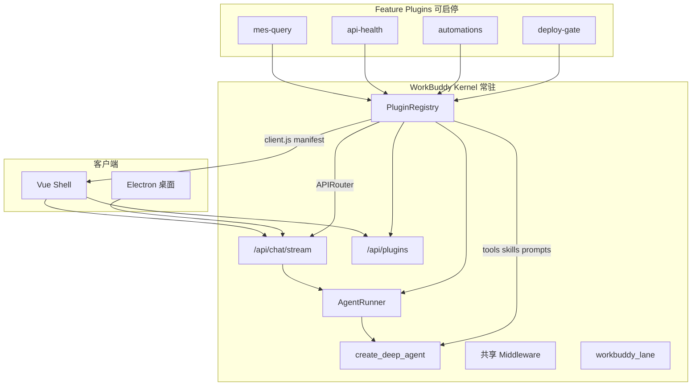
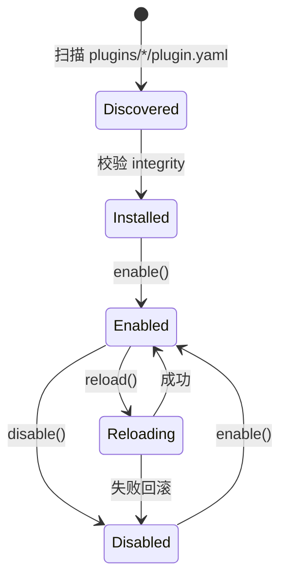

# WorkBuddy 整功能热插拔插件 — 架构设计方案

> **文档性质**：设计方案（Design Doc），**不含实现代码**。  
> **状态**：待评审 · 未开工  
> **位置**：[`docs/插件/架构设计方案.md`](./架构设计方案.md)  
> **插件包目录**（实现阶段）：仓库根 [`plugins/<id>/`](../../plugins/)  
> **关联**：[DeepAgents 与 DeepSeek Harness 选型](../Agent开发/DeepAgents与DeepSeek-Harness技术选型分析.md)、[功能实现总览](../功能实现/00-总览与架构分流.md)、[DSH 架构调研](../Agent开发/dsh-architecture-report.zh.md)

---

## 1. 背景与动机

### 1.1 现状

ZR WorkBuddy 的 11 项业务能力已基本落地，技术形态统一为 **Tool + Skill +（可选）Middleware + 旁路 API**（见 `docs/功能实现/01–11`）。但代码组织仍是 **单体 monolith**：

| 层次 | 现状 | 问题 |
|------|------|------|
| Agent 工具 | `apps/agent/agents/agent.py` 硬编码 40+ import 与 `TOOLS` 列表 | 增删功能必改中央文件；无法单独发版 |
| Skills | `apps/agent/skills/*/SKILL.md` 目录化，但 `SKILL_SOURCES` 全量扫描 | 无法按功能开关 Skill 集合 |
| API | `apps/api/main.py` 启动时 `include_router` | 路由与功能生命周期绑定进程 |
| 前端 | `ChatView.vue` + `chatIntent.js` 集中意图分流 | 部署/提交/自动化等 UI 与壳耦合 |
| 打包 | `desktop/py/build_runtime.py` 整包复制 `apps/*` | 修一个功能也要重打完整 dmg |

### 1.2 目标（产品诉求）

1. **整功能插件化**：每个功能 = Agent（tools/skills）+ API + 前端，边界清晰。
2. **运行时热插拔**：像 DeepSeek Harness 插件中心一样，**enable/disable 无需重启 API**。
3. **独立部署**：发版时 **只更新某一个插件包**，不影响其它插件与内核。

### 1.3 非目标（明确不做）

- **不**把主 harness 换成 DeepSeek Harness / Cordis / `dsh web`（见 P0 锁定）。
- **不**第一阶段拆满 11 个插件；先 1–2 个试点验证契约。
- **不**追求「零停机替换 Python 进程内所有模块」的极端热更；允许进行中 SSE 优雅收尾。
- **不**把 auth、checkpoint、WriteConfirm 等 **平台安全件** 拆进业务插件。

---

## 2. 设计原则

1. **内核稳定、功能可插拔**：对话 SSE、AgentRunner、共享 Middleware、车道解析、插件中心 = Kernel。
2. **Deep Agents 不变**：插件向 `create_deep_agent(tools=..., skills=..., middleware=...)` **注册**，不另起 Agent 框架。
3. **旁路执行不变**：写码/提交/部署仍走 Cursor + local_dev API + 确认卡；插件只 **搬迁** 代码边界，不改 HITL 模型。
4. **兼容优先**：旧 URL（如 `/api/automations`）通过 manifest `legacy_prefix` 保留，避免一次大爆炸迁移。
5. **可观测**：每个插件 enable/disable/reload 写审计日志；失败可回滚到上一版本目录。

---

## 3. 目标架构

### 3.1 总体分层



### 3.2 内核（Kernel）清单

| 组件 | 路径 | 职责 | 是否可卸载 |
|------|------|------|------------|
| 认证 | `apps/api/routes/auth.py` | JWT / 会话 | 否 |
| 对话 SSE | `apps/api/routes/chat.py` | 统一聊天入口 | 否 |
| Agent 运行时 | `apps/api/agent_wrapper.py` | 流式、checkpoint、`reset_agent()` | 否 |
| Deep Agent 工厂 | `apps/agent/agents/agent.py` | 从 Registry 组装 agent | 否 |
| 共享 Middleware | `apps/agent/middleware/` | 审计、路径守卫、写确认 | 否 |
| 车道 | `apps/api/workbuddy_lanes.py` | lane 解析与互斥 | 否 |
| MES Profile | `apps/agent/mes_profile/` | 实体包（内核能力，可被插件依赖） | 否 |
| 平台 HTTP | `apps/agent/tools/platform_api.py` | MES/ERP 客户端 | 否 |
| 插件宿主 | **新建** `apps/plugin_host/` | 扫描、启停、安装、签名 | 否 |
| Web Shell | `apps/web/`（精简） | 壳 + 插件中心 UI | 否 |

### 3.3 插件（Plugin）标准目录

Monorepo 阶段放在仓库根 **`plugins/<id>/`**；桌面 runtime 对应 `desktop/runtime/app/plugins/<id>/`。

```text
plugins/<id>/
  plugin.yaml           # 清单（版本、依赖、能力、路由前缀）
  agent/
    tools.py            # TOOLS: list[Callable]
    skills/             # 本插件 SKILL.md
    prompts.py          # 可选：lane / system 附加片段
  api/
    routes.py           # router = APIRouter(...)
    lifecycle.py        # on_enable / on_disable / on_reload
  web/
    manifest.json       # 路由、侧栏、Chat 扩展点声明
    src/                # 源码
    dist/client.js      # vite lib 构建产物
  tests/
  CHANGELOG.md
```

清单模板见 [`plugin-yaml-example.md`](./plugin-yaml-example.md)。

---

## 4. 插件契约（plugin.yaml）

### 4.1 完整 Schema（草案）

```yaml
id: mes-query
version: 1.2.0
name: MES 数据查询导出与分析
features: ["02"]

depends_on:
  - kernel
  - mes-profile

agent:
  tools_module: agent.tools
  skills_dirs: [agent/skills]
  lane_prompts_module: agent.prompts
  lanes: []

api:
  router: api.routes:router
  prefix: /api/p/mes-query
  legacy_prefixes: []
  tags: ["MES 查数"]

web:
  entry: web/dist/client.js
  sidebar:
    - label: 自动化任务
      path: /automations
      icon: timer

lifecycle:
  module: api.lifecycle

integrity:
  sha256: "<zip 或目录 manifest 哈希>"

capabilities:
  - chat.tools
  - chat.skills
  - api.routes
  - web.routes
  - scheduler
```

### 4.2 Python 插件 API 约定

**`agent/tools.py`**

```python
TOOLS = [
    list_platform_entities,
    query_platform_data,
]
TOOL_METADATA = {
    "query_platform_data": {"plugin_id": "mes-query", "feature": "02"},
}
```

**`api/routes.py`**

```python
router = APIRouter(prefix="/api/p/mes-query", tags=["MES 查数"])
```

**`api/lifecycle.py`**

```python
async def on_enable(ctx): ...
async def on_disable(ctx): ...
async def on_reload(ctx): ...
```

### 4.3 Web 插件 entry 约定

```javascript
export default {
  id: 'automations',
  version: '1.0.0',
  routes: [
    { path: '/automations', name: 'Automations', component: () => import('./AutomationsView.vue') },
  ],
  sidebar: [{ label: '自动化任务', path: '/automations', icon: 'timer' }],
  chatExtensions: {
    intentDetectors: [
      { priority: 100, detect: (text, ctx) => null },
    ],
    gateCards: {
      localDevDeploy: () => import('./LocalDevDeployGateCard.vue'),
    },
  },
  settingsSections: [],
}
```

---

## 5. 运行时热插拔机制

### 5.1 PluginRegistry 状态机



**持久化**：`data/plugins/state.json`

```json
{
  "enabled": ["mes-query", "api-health", "automations"],
  "installed": {
    "mes-query": { "version": "1.2.0", "path": "plugins/mes-query" }
  }
}
```

### 5.2 enable / disable 步骤（不重启进程）

**enable(id)**：校验依赖 → import 模块 → 注册 tools/skills/routes → `lifecycle.on_enable` → `AgentRunner.reset_agent()` → 通知前端刷新 manifest。

**disable(id)**：检查 stream 锁 → `lifecycle.on_disable` → 移除注册 → 路由 Middleware 404 → `reset_agent()` → 隐藏 UI。

**reload(id)**：disable → 原子替换目录 → 清 `sys.modules` 前缀 → enable → 失败则 `.backup` 回滚。

### 5.3 Agent 签名与惰性重建

将 `AgentRunner` 硬编码 `_TOOLS_SIG` 改为：

```python
def compute_tools_sig(registry) -> str:
    parts = [
        sorted(registry.enabled_ids()),
        sorted(registry.tool_names()),
        sorted(registry.skill_dirs()),
    ]
    return hashlib.sha256(json.dumps(parts).encode()).hexdigest()[:16]
```

### 5.4 API 路由「卸载」策略

| 层级 | 做法 |
|------|------|
| 新路由 | 统一前缀 `/api/p/<plugin_id>/...` |
| 兼容旧路由 | `legacy_prefixes` + **PluginGatewayMiddleware** |
| disabled | 404 + `{"detail":"功能已关闭"}` |

### 5.5 前端热更新

Shell 启动拉 `GET /api/plugins/enabled`，动态 `import()` 各 `client.js`；插件变更时卸载旧路由并重新注册。仅加载 sha256 校验通过的包。

---

## 6. 功能 → 插件映射（01–11）

| # | 功能 | plugin id | Agent | API | Web | 备注 |
|---|------|-----------|-------|-----|-----|------|
| 01 | PCB 专业对话 | `pcb-domain` | skill | — | — | 可与 mes-query 合并讨论 |
| 02 | MES 查数导出 | `mes-query` | tools+skills | — | — | 依赖 mes-profile |
| 03 | 文件导入 | `file-import` | tools+skill | writes 走内核 | 确认卡 | WriteConfirm 留内核 |
| 04 | 表结构摸底 | `mes-schema` | tools+skill | — | — | |
| 05 | API 健康 | `api-health` | tools+skill | — | — | **Phase 0 试点** |
| 06 | 粘贴代码 | `paste-code` | skill+lane | — | — | |
| 07 | 代码审核 | `code-review` | ide/git tools | ide-bridge | 入口 | |
| 08 | 写码讨论 | `code-dev` | skill+lane | local_dev/cursor | propose 卡 | 执行仍 Cursor |
| 09 | 人触发提交 | `commit-batch` | skill(只读) | commit API | 确认卡 | |
| 10 | 人触发部署 | `deploy-gate` | — | deploy API | DeployGateCard | |
| 11 | 自动化 | `automations` | executor | CRUD+scheduler | AutomationsView | **Phase 1 试点** |

**可选合并**：`mes-query` + `mes-schema` → `mes-intelligence`；`paste-code` + `code-review` + `code-dev` → `code-assistant`。

---

## 7. 部署与发版模型

| 制品 | 内容 | 发版频率 |
|------|------|----------|
| **Kernel** | API + agent 内核 + Web Shell | 低 |
| **Plugin zip** | 单个 `plugins/<id>/` + 签名 | 高 |
| **Desktop dmg** | Kernel + 默认内置插件集 | 中 |

单插件更新：`install zip` → 校验 → 原子替换 → `reload(id)` → `reset_agent()`，其它插件不动。

`build_runtime.py` 目标：`runtime/app/kernel/` + `runtime/app/plugins/<id>/` 分包。

---

## 8. 与 DeepSeek Harness 对照

| 维度 | DSH | WorkBuddy |
|------|-----|-----------|
| 插件单元 | npm Cordis 包 | Python 目录 + `plugin.yaml` + `client.js` |
| 启停 | Plugin Center | `/api/plugins` + 设置页 |
| 主循环 | 可替换 | **固定 Deep Agents** |

学 DSH **产品形态**，不引入 DSH **运行时**。

---

## 9. 分阶段路线图

### Phase 0（1–2 周）

- `apps/plugin_host/` + `/api/plugins`
- `create_agent()` 动态 tools/skills
- 试点 **`api-health`**

### Phase 1（2–3 周）

- 插件 **`automations`** 整包
- Web Shell 动态路由 + 插件中心页

### Phase 2（3–4 周）

- `deploy-gate` / `commit-batch` / `code-dev` / `code-review`
- `chatIntent.js` → 插件 intent 链

### Phase 3（2 周）

- zip + sha256 + 回滚
- `build_runtime.py` 分包
- 插件开发模板

> **分档说明**：完整路线图（Phase 0–3）对应下文 **路线 C（完整热插拔）**。若 ROI 不足，优先实施 **路线 B**，见 §10。

---

## 10. 成本与价值评估

> 评审结论：**「功能插件化」有意义；「运行时热插拔」需单独算账，现阶段未必值得付全价。** 建议 **分档实施**，默认走 **路线 B**。

### 10.1 要解决的实际问题

| 诉求 | 是否成立 | 备注 |
|------|----------|------|
| 发版隔离：修一个功能、少回归其它 | 是 | 现场若常 hotfix 单一模块，价值高 |
| 运行时 disable：不关进程即关功能 | 部分 | 桌面单用户场景优先级可低于 SaaS |
| 边界清晰：不再改中央 `agent.py` | 是 | **不依赖热插拔**，模块化即可达成 |
| 叙事对齐 DSH 插件中心 | 部分 | 产品话术有用，技术 ROI 需单独评估 |

### 10.2 实现成本（粗估，1 人全职）

| 阶段 | 工作 | 人周 | 主要难点 |
|------|------|------|----------|
| Phase 0 | Registry、`create_agent` 动态化、试点 `api-health` | 2–3 | 与 monolith 双轨并存 |
| Phase 1 | `automations` 整包 + Web 动态路由 + 插件中心 | 3–4 | ChatView / scheduler 生命周期 |
| Phase 2 | deploy / commit / code-dev / code-review 迁插件 | 4–6 | 旁路与对话强耦合 |
| Phase 3 | zip、sha256、runtime 分包 | 2 | 两套交付链（dmg + 插件 zip） |
| **合计（路线 C）** | 全文方案 | **约 11–15 人周** | 不含 11 功能全部迁完后的长期回归 |

**持续成本**：插件 enable 组合测试矩阵；`platform_api` / middleware / lane 共享导致的依赖网；Python 热 reload 与进行中 SSE 的边界；前端每插件独立构建与版本对齐。

### 10.3 价值分层

**高价值（不做热插拔也能拿到）**

- 功能边界清晰，与 `docs/功能实现/01–11` 一一对应
- 少改 `agent.py`、`main.py`、`ChatView.vue`，降低 merge 冲突
- 按功能独立发版的组织叙事

**中等价值（视部署形态而定）**

- 只更一个 zip、不重打 dmg → 若多数仍整包升级 dmg，收益有限
- 运行时 disable → 配置开关 + 重启往往够用
- 第三方插件 → 短期概率低

**低价值 / 易高估**

- **完全不重启 API**：Agent 单例、checkpoint、FastAPI 路由卸载在实践中常需 **进程重启** 才稳
- **11 个细粒度插件**：共享内核多，拆太细反而依赖管理更复杂

### 10.4 与现状的匹配度

- **交付**：Electron + 内嵌 Python，当前 `build_runtime.py` 整包复制；插件 zip 是第二条交付链
- **耦合**：MES 查数、导入、WriteConfirm、entity_catalog 与内核绑定深，「整功能」边界需人为划定
- **团队**：偏单人/小团队时，插件化主要收益是边界清晰；**双制品运维**可能是负担

### 10.5 三种路线对比

| 路线 | 实现成本 | 发版隔离 | 运行时关功能 | 推荐度 |
|------|----------|----------|--------------|--------|
| **A. 维持 monolith** | 0 | 差 | env 开关 | 短期可接受，长期难维护 |
| **B. 模块化 monolith** | 低～中（4–6 人周） | 中～高 | 配置 + **重启 API** | **默认推荐** |
| **C. 完整热插拔**（本文 Phase 0–3 全文） | 高（11–15+ 人周） | 高 | 高（实现脆） | 满足 §10.6 触发条件后再做 |

**路线 B 要点**（保留约 70% 设计、砍掉最贵部分）：

- 保留 `plugins/<id>/` + `plugin.yaml`
- **启动时**扫描注册（非 runtime reload）
- 发版：替换插件目录 → **重启 API**（`stop.sh && dev.sh` 或桌面内重启）
- disable：改 `data/plugins/state.json` → 下次启动或重启生效
- **暂缓**：Web 动态 `import client.js`、Python `sys.modules` 热 reload、插件中心 UI

### 10.6 何时升级到路线 C

满足 **任一** 再投入完整热插拔：

1. 现场 **每月多次** 只更新单一功能，且不能接受重启 API
2. 需 **按客户/环境** 开闭功能，且不能发新 dmg
3. **≥2 人** 并行开发不同功能，merge 冲突已成为瓶颈

### 10.7 决策摘要

| 问题 | 建议 |
|------|------|
| 插件化有没有意义？ | **有**，优先边界与分包 |
| 热插拔有没有意义？ | **有条件**，默认 **不做** |
| 第一步做什么？ | 路线 B：目录约定 + 启动注册 + **1 个试点**（`api-health` 或 `automations`） |
| 成功标准要不要改？ | 路线 B 下：disable 可接受 **重启后生效**；见 §13 |

---

## 11. 风险与对策

| 风险 | 对策 |
|------|------|
| SSE 进行中 disable | stream 锁检查；PluginToolGuard middleware |
| import 热 reload 泄漏 | reload 限频；兜底 graceful restart |
| 循环依赖 | DAG 校验 |
| 恶意 client.js | sha256 + 仅信任 signed 包 |
| monolith 双轨 | 新功能只准插件；旧代码排期迁移 |

---

## 12. 开放问题

1. 11 个独立插件 vs 5–6 个域插件？
2. `mes-profile` 内核内置还是独立插件？
3. install 是否需管理员权限？
4. 多 worker 下插件 state 文件锁？
5. 是否支持第三方插件？

---

## 13. 成功标准

### 路线 C（完整热插拔）

1. 设置页关闭插件 → **30 秒内** UI + API + Agent 一致关闭，**无需重启**。
2. 仅更新单个插件 zip → reload → 其它功能回归通过。
3. 新功能 **不改** `agent.py` 中央 TOOLS 列表。

### 路线 B（模块化 monolith，默认）

1. 新功能 **只新增** `plugins/<id>/`，不改中央 `agent.py` 列表。
2. 仅替换某一插件目录并 **重启 API** 后，该功能升级、其它功能冒烟通过。
3. `data/plugins/state.json` 关闭某插件后，**重启后** 侧栏/API/Agent 工具均不可用。

---

## 14. 下一步

- [ ] 团队评审本文档（含 §10 成本与路线选择）
- [ ] 定夺：默认 **路线 B** 还是直接 **路线 C**
- [ ] 定夺开放问题（粒度、权限、mes-profile）
- [ ] 用户确认「开始实现」后，按选定路线开工（建议：路线 B + 单插件试点）

---

## 附录 A：关键代码锚点

| 用途 | 文件 |
|------|------|
| 工具注册 | `apps/agent/agents/agent.py` |
| Agent 重建 | `apps/api/agent_wrapper.py` |
| API 路由 | `apps/api/main.py` |
| 意图旁路 | `apps/web/src/chatIntent.js` |
| 自动化调度 | `apps/automations/scheduler.py` |
| 桌面打包 | `desktop/py/build_runtime.py` |
| Harness 锁定 | `.cursor/rules/agent-harness-deep-agents.mdc` |
