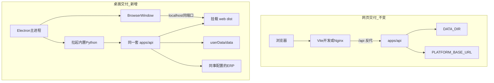

# WorkBuddy 桌面端与网页双交付方案

> 状态：**P0 完整安装包链路已接通（打 dmg/exe 后安装配 Key 可用；内测验证中）**  
> 日期：2026-08-12  
> 目标：同事本机安装桌面应用，配置 Key / ERP 后即可使用；**同时保留现有网页形态**  
> 前提：**不影响现有全部功能的正常使用**（`dev.sh` 网页联调、登录、对话、本机写码、预览等）  
> 相关：[`本机目录写码与沙箱隔离方案.md`](./本机目录写码与沙箱隔离方案.md)、[`ERP登录对接说明.md`](./ERP登录对接说明.md)、[`平台嵌入说明.md`](./平台嵌入说明.md)、[`桌面端安装与配置说明.md`](./桌面端安装与配置说明.md)

---

## 0. 实施总则（必须遵守）

本方案是**第二交付通道**，不是替换网页。落地时一律遵守：

1. **网页主线优先**  
   - [`scripts/dev.sh`](../scripts/dev.sh) / [`scripts/stop.sh`](../scripts/stop.sh) 行为不得被桌面改动破坏。  
   - 默认端口约定保持：探活沙箱 `8001`、API `8765`、Vite `5180`。

2. **业务代码只共用、不分叉**  
   - 对话 / 历史 / 设置 / 本机写码 / Cursor 车道等业务逻辑仍在 `apps/api`、`apps/agent`、`apps/local_dev`、`apps/web`。  
   - 桌面仅新增**启动壳与打包脚本**（建议目录 `desktop/`），禁止复制一套业务实现。

3. **一切对主线的改动必须「可选默认关」**  
   - 例如：仅当设置了 `WEB_DIST_DIR`（或探测到打包用 dist）才挂载静态前端；`dev.sh` **不**设置该变量。  
   - 桌面专用环境变量（如 `WORKBUDDY_DESKTOP=1`）只影响日志、端口策略、子进程生命周期，不改变网页语义。

4. **小步合入 + 双轨验收**  
   - 每合并一刀：先跑网页冒烟，再跑桌面冒烟。  
   - 任一轨回归失败，回滚该刀，不得「先合再补」。

5. **不把密钥打进安装包**  
   - Key / ERP 地址由同事在「系统配置」填写，落盘用户目录 `settings.json`（与现热更新机制一致）。

---

## 1. 结论

**可行。** 桌面与「本机目录写码 / 选文件夹 / 同步后预览」同机假设一致，比纯远程网页更合适。

| 项 | 选型 |
|----|------|
| 壳 | **Electron**（拉起 Python 子进程、打包成熟；本期不做 Tauri） |
| 系统 | **macOS + Windows**（electron-builder 同流水线） |
| 形态 | 安装后双击 → **内嵌窗口**打开本机 UI（非「只起服务再开浏览器」） |
| 登录 | 仍走 ERP `PLATFORM_BASE_URL`；不可达时回落探活沙箱（与现网一致） |
| 前端请求 | 继续相对路径 `/api`（[`apps/web/src/api.js`](../apps/web/src/api.js)），桌面与 API **同 origin** |

---

## 2. 双交付对照（互不影响）

| 维度 | 网页（现有） | 桌面（新增） |
|------|-------------|-------------|
| 启动 | `dev.sh`：sandbox:8001 + API:8765 + Vite:5180 | Electron 拉起内置 API（旁路起探活沙箱） |
| 前端 | Vite 开发 / 独立部署 dist | 预构建 `apps/web/dist`，由 API **同端口**静态托管 |
| API 地址 | `/api` + Vite 反代 | 同 origin，无需改前端 baseURL |
| 配置 | 根目录 `.env` + `/settings` | 安装包只读资源 + 用户目录可写 `DATA_DIR` / `settings.json` |
| 代码 | 共用 `apps/*` | 仅新增 `desktop/` + `scripts/package-desktop.sh` |
| 嵌入 ERP iframe | [`平台嵌入说明.md`](./平台嵌入说明.md) | **不替代**；嵌入场景仍用网页 |

---

## 3. 桌面进程模型

同事感知为「一个 App」：

1. **Electron main**  
   - 单实例锁；端口空闲探测（建议默认 `18765`，冲突则递增，避免与开发 `8765` 打架）。  
   - 注入环境变量：  
     - `DATA_DIR=<userData>/data`  
     - `MES_SERVER_PORT=<选中端口>`  
     - `WORKBUDDY_DESKTOP=1`  
     - `WEB_DIST_DIR=<包内 web dist>`  
     - `API_PROBE_SANDBOX_URL=http://127.0.0.1:<sandbox端口>`  
   - spawn 打包进安装包的 API 可执行文件（或嵌入式 Python 入口）。  
   - 轮询 `/health` 成功后打开 `BrowserWindow` → `http://127.0.0.1:<port>/`。  
   - 退出时结束子进程（对齐 `stop.sh`，防僵尸占用端口）。

2. **Python API（同一套 [`apps/api/main.py`](../apps/api/main.py)）**  
   - **可选**静态托管：仅当 `WEB_DIST_DIR` 指向有效 dist 时挂载 `/`；**API 路由优先**；SPA 需 `index.html` fallback。  
   - 探活沙箱：P0 由桌面壳或 API 启动钩子拉起 [`apps/sandbox/server.py`](../apps/sandbox/server.py)，保证 ERP 不可达时仍可登录回落。

3. **不在桌面包内跑 Vite 开发服务器**  
   - 打包流水线先 `npm run build`，再打安装包。

---

## 4. 配置与「只配 Key」体验

### 4.1 已有

- [`SettingsView`](../apps/web/src/views/SettingsView.vue) + [`settings_store`](../apps/agent/settings_store.py)：对话模型 / 视觉 / Cursor 等 Key 热更新。

### 4.2 桌面 P0 必须补齐

| 配置项 | 原因 |
|--------|------|
| 对话模型 Key / Base URL / 模型名 | 对话核心（已有 UI） |
| **`PLATFORM_BASE_URL`** | 今日主要在 `.env`；桌面同事必须可配，否则只能依赖沙箱登录 |

可选：视觉 Key、本机写码说明文案。

### 4.3 首次启动引导（建议）

1. 打开「系统配置」  
2. 填写 LLM Key + ERP 地址并保存  
3. 登录 → 与网页同一套鉴权流程（见 [`ERP登录对接说明.md`](./ERP登录对接说明.md)）

### 4.4 数据目录

- 路径：`app.getPath('userData')/data/`（结构与现 `data/` 一致：history、uploads、local_dev、settings.json 等）。  
- **升级 App 不得清空该目录**，避免丢会话与本机写码偏好。

---

## 5. 功能完整性矩阵

| 能力 | 桌面 | 说明 |
|------|------|------|
| 对话 / 历史 / 设置 | 完整 | 同 API |
| ERP 登录 | 完整 | 配 `PLATFORM_BASE_URL`；回落沙箱与网页一致 |
| 本机目录写码 + 选文件夹 | **优于远程网页** | `pick-folder` 在 API 所在机弹窗 |
| 同步后预览 | 完整（有前提） | 本机起前后端；**需同事机有 Node 18+**（与现本机写码一致） |
| Cursor Cloud / IDE Bridge | 按 Key/扩展可选 | 缺 Key 熔断，不拖垮主流程 |
| 平台 iframe 嵌入 | 网页交付 | 桌面不替代 |

预览依赖说明：

- **P0**：安装说明写明需 Node 18+（仅使用「同步后自动预览」时）。  
- **P1**：设置页或健康检查检测 `node`/`npm`，缺失时明确提示，禁止静默失败。

---

## 6. 对现有代码的允许改动（小而可选）

| 改动 | 约束 |
|------|------|
| API 可选挂载 `web/dist` | 仅 `WEB_DIST_DIR` 有效时；`dev.sh` 不启用 |
| Settings 增加 `PLATFORM_BASE_URL` | 网页/桌面共用；解析顺序仍为 **UI settings → env → 默认** |
| `WORKBUDDY_DESKTOP=1` | 仅桌面壳注入；不得改变网页默认行为 |
| 前端 `/api` | **禁止**写死 `http://127.0.0.1:8765`，以免桌面动态端口失败 |

**明确不改（P0）**：Agent 工具链核心、local_dev 沙箱闸门语义、Cursor 车道主流程、平台嵌入协议。

---

## 7. 打包与分发

### 7.1 建议目录与脚本

- `desktop/`：Electron（main / preload / electron-builder）  
- `scripts/package-desktop.sh`：`web build` → 准备 Python 运行时 → `electron-builder`  
- 用户文档（落地后另写）：`docs/桌面端安装与配置说明.md`（安装步骤、配 Key、常见问题）

### 7.2 Python 运行时（P0 推荐）

- 用 **PyInstaller** 或 **python-build-standalone** 产出 `workbuddy-api` 可执行文件，Electron 只负责 spawn。  
- 打进包的是应用代码与冻结依赖；**禁止**打入开发机 `data/local_dev/sandboxes`、真实 Key、`.env` 密钥。

### 7.3 产物

- macOS：`.dmg` / `.zip`（Apple 公证可放 P1）  
- Windows：安装包 `.exe`（SmartScreen 签名可放 P1）  
- 版本号可与网页解耦，但建议共享 semver 前缀便于对照。

### 7.4 仓库

- 发版推送到 **WorkBuddy 仓**（`pythonProject_jxzr_workBuddy`），勿推到 ERP 样例仓。

---

## 8. 风险与边界

| 风险 | 缓解 |
|------|------|
| 安装包体积大（Electron + Python） | 内测可接受；P2 再评估精简 |
| 未签名被拦截 | 内部分发说明「右键打开」；正式签名放 P1 |
| 预览依赖本机 Node | 文档 + 健康检查提示 |
| LLM / 外网 | 与网页相同；内网只需 ERP 可达 |
| 多开抢端口 | 单实例锁 + 端口探测 |
| 静态托管误伤 API 路由 | 路由注册在前，静态与 SPA fallback 在后；加集成测试 |
| 改 settings 白名单影响网页 | 仅新增字段；默认空则仍读 env |

---

## 9. 分阶段实施（谨慎顺序）

每阶段结束必须通过 **§10 验收** 再进入下一阶段。

### P0 — 可内测安装

1. ~~API **可选**静态托管 + SPA fallback~~（`WEB_DIST_DIR`；`dev.sh` 不启用）。  
2. ~~Settings / settings_store 增加 `PLATFORM_BASE_URL`~~（网页亦可配）。  
3. ~~`desktop/` 壳：单实例、起停 API、健康检查、退出清理~~。  
4. ~~打包内嵌 CPython 运行时 + electron-builder~~（`desktop/py/build_runtime.py` + `scripts/package-desktop.sh` → `desktop/release/*.dmg`）。  
5. 3～5 人内测：安装 → 配 Key/ERP → 登录 → 对话 → 本机写码确认卡。

### P1 — 好用

- 首次引导向导；API / ERP / Node 健康检查页。  
- 代码签名 / 公证；可选自动更新。

### P2 — 体验增强

- 托盘、日志导出；评估预览用内置 Node（非必须）。

---

## 10. 验收标准（双轨）

### 10.1 网页轨（不得退化）

- `./scripts/dev.sh` 可起全栈；登录、对话、历史、系统配置可用。  
- 本机写码：选目录 → 确认 → 沙箱同步 →（有工程时）预览链路与改桌面前一致。  
- 平台嵌入、Cursor / IDE 等既有能力无回归。

### 10.2 桌面轨（新能力）

- 干净机器（无仓库、仅缺业务 Key）：安装 → 配 Key/ERP → 登录 → 对话。  
- 本机选目录写码可用；有 Node 时预览可用，无 Node 时有明确提示。  
- 卸载/升级不误删用户 `userData/data`（除非用户显式清理）。  
- 无「桌面专用业务分叉」；差异仅限启动与静态托管。

### 10.3 回归清单（每次合入桌面相关改动）

- [ ] `dev.sh` 健康检查三端口  
- [ ] 网页登录（真实 ERP 或沙箱回落）  
- [ ] 网页发一条对话  
- [ ] 网页打开系统配置保存（不破坏已有 Key）  
- [ ] 若改动了静态托管：确认 **未设 `WEB_DIST_DIR` 时** API `/docs`、`/api/*` 行为不变  

---

## 11. 落地时关键路径速查

| 用途 | 路径 |
|------|------|
| API 入口 | `apps/api/main.py` |
| 设置存储 | `apps/agent/settings_store.py`、`apps/api/routes/settings.py` |
| 设置页 | `apps/web/src/views/SettingsView.vue` |
| 前端 API 基址 | `apps/web/src/api.js`（保持 `/api`） |
| 本机写码 | `apps/local_dev/`、`apps/api/routes/local_dev.py` |
| 探活沙箱 | `apps/sandbox/server.py` |
| 网页启动 | `scripts/dev.sh` |
| 桌面壳 | `desktop/`、`scripts/run-desktop-dev.sh`、`scripts/package-desktop.sh`、`docs/桌面端安装与配置说明.md` |

---

## 12. 一句话

**网页继续用 `dev.sh`；桌面用 Electron 包同一套 API+前端，同事只配 Key 和 ERP。所有对主线的改动默认关闭、双轨验收，宁可慢不可把现网用挂。**
